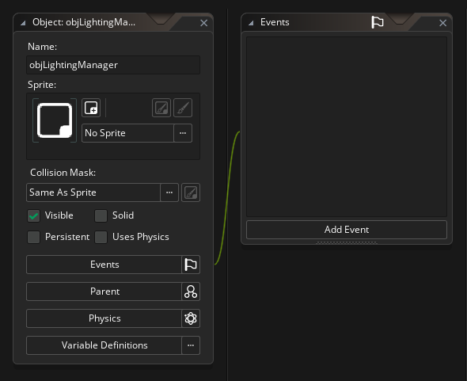
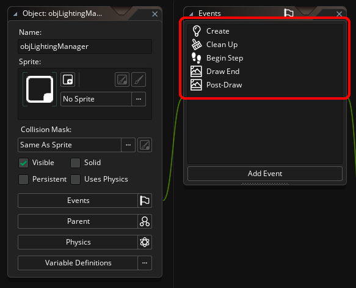
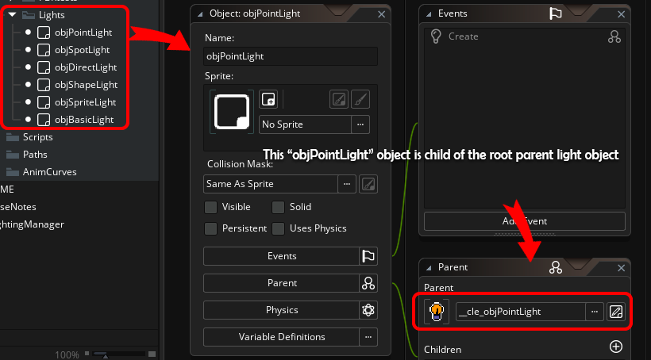
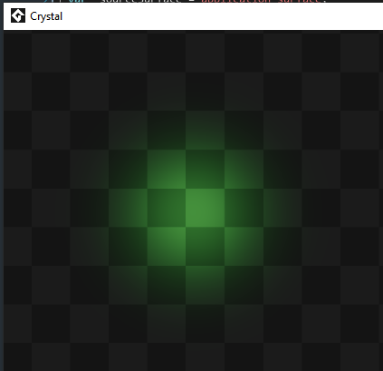
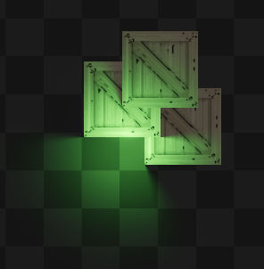
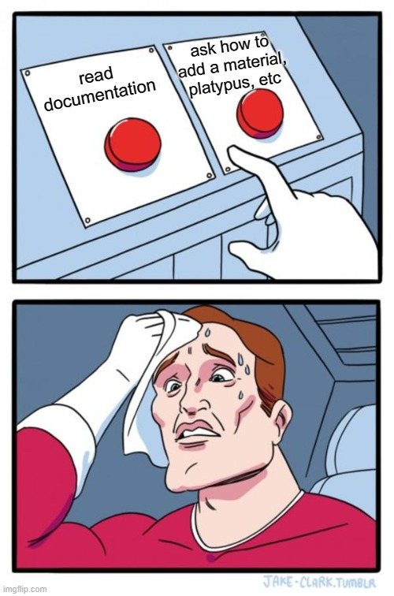

## Getting started with Crystal <!-- {docsify-ignore} -->

This page explains how to easily add Crystal to your game.
This quick-start guide requires a basic knowledge of GML and GameMaker. No shader knowledge is required.  
This is just an introduction, read the rest of the documentation for more details.  

Estimated setup time: 10 min or less.

> You can also see the project working in the .yyz example GM project.

> There is complete Feather documentation as well.

</br></br>


## Briefing <!-- {docsify-ignore} -->

This guide is divided into the following parts:

1 - Importing Crystal package into your game;  
2 - Creating an object for the Lighting Manager and add events with codes;  
3 - Add lights;  
4 - Add shadows;  
5 - Additional information;  

</br>


## 1. Importing Crystal package <!-- {docsify-ignore} -->

See [installation](./pages/installation.md) guide.

</br>


## 2. Create a Manager object <!-- {docsify-ignore} -->

First of all, Crystal will never do anything you don't allow, so nothing in the game is touched until you allow it. The crystal works in parallel, in its "own bubble".  

You will need an object where all Crystal rendering will occur.  



The object does not need to be persistent, but it can be, it is optional.  
You can also use it as a parent and have other lighting manager objects if you want.

### Add some events

You need to add the following events to the object for Crystal to work:
Create, Clean Up, Begin Step, Draw End and Post-Draw.



Add the following codes for each event:

```gml
// Create Event
// create system responsible for rendering lights, shadows, materials, etc.
renderer = new Crystal_Renderer();

// Clean Up
// free from memory when not in use.
renderer.Destroy();

// Begin Step
// needed to process some internal things before all other events.
renderer.PreRender();

// Draw End
// renderize everything related to the lighting system renderer, using application_surface as input surface and view 0 camera.
renderer.Render(application_surface, view_get_camera(0));

// Post Draw
// draw lighting system's final surface to the screen.
renderer.DrawInFullscreen();
```

> If you use post-processing, Post-Draw is optional (since post-processing will have control over the final Crystal drawing).

If you are calling `.DrawInFullscreen()` In order to **visualize Crystal's drawing**, you need to make sure that the automatic drawing of the `application_surface` is **disabled**, since Crystal will draw it manually. That said, disable automatic drawing with `application_surface_draw_enable(false);` Just call it anywhere (Create or Room Start event, for example) while you are drawing Crystal.  

> Make sure **viewports are enabled** and you have at least 1 view port **visible**.

> To avoid blending issues, it is good practice to enable the **"Clear Display Buffer"** option in the room settings.

Add this object to a room, either by code or by dragging it into the room.

</br>


## 3. Add lights <!-- {docsify-ignore} -->

Crystal uses GM objects as lights. It is the only thing in Crystal that does not use constructors, for performance reasons currently.

Lights are located in:  
`KazanGames > CrystalLightingEngine > Assets > Objects > Lights (Parents).`

These objects are root parent objects, so it is recommended that you do not use them directly, but create objects that have these lights as parents.

> If you drag these objects directly to the room, if you delete Crystal from the project, these objects will be removed too, so you should not use them directly, but rather create children.



With these objects created, you can create **variations** of lights that are **children** of it. Example: blinking lights, etc.  
You can also create the lights via code, like a normal instance:
```gml
// Create a light in the "Lights" room layer and change some properties
var _light = instance_create_layer(100, 100, "Lights", objPointLight);
_light.color = c_lime;
_light.radius = 128;
_light.intensity = 1.2;
```

> WARNING: The "Basic Light" object does not have a light sprite by default, so you may not see the light. I recommend using the "Point Light" to start and test.

Now we have a light! :D


> If the light hasn't appeared on yours yet, it may be because your background is completely black (more info below).  

</br>


## 4. Add shadows <!-- {docsify-ignore} -->

Adding shadows is pretty straightforward. Crystal supports both **vertex shadows** and **sprite shadows**, but in this quick start guide we'll show you how to add **vertex shadows**.

Vertex shadows are efficient shadows generated from vertices (points) that we refer to as **"meshes"** in Crystal.

First, **if you want a light to cast shadows**, enable the light's `castShadows` variable.

To create shadows, you create a `Crystal_Shadow()`, add `Crystal_ShadowMesh()` to it, and use `.Apply()` to send the shadow to the lighting renderer.

A `Crystal_ShadowMesh()` is just a struct containing the list of points.

Crystal supports animated shadows, which means you can add multiple meshes, where each mesh is 1 frame.

Crystal supports both **static** and **dynamic** shadows. Static shadows are SUPER FAST, generally used for objects that will *not move* (such as scenery) and dynamic shadows are for objects that *move, rotate, and scale* (such as players, enemies, platforms, etc.).

In the example below, we are creating a *static* shadow for a box object.

```gml
shadow = new Crystal_Shadow(id, CRYSTAL_SHADOW.STATIC);
shadow.AddMesh(new Crystal_ShadowMesh().FromSpriteRect(sprite_index));
shadow.shadowLength = 1;
shadow.Apply();
```

> The "id" is used to get the initial depth, position, scale and rotation of the instance, but is optional (you can use `noone`).

> `Crystal_Renderer()` needs to exist before you can add things to it (like when using `.Apply()`).

> Even after using `.Apply()`, you can change the `x` and `y` position, `depth` and other parameters of the shadow. This behaviour is valid for everything in Crystal.

> There are several functions/methods you can use to create vertex shadows easily, check out the documentation for more info.

> You can create multiple shadows in the same instance... but usually just 1 is enough.

If the "penumbra" of the shadows is appearing on top, activate `selfShadows`. See other tips in the "Tutorials" section.

Point light with vertex shadows enabled in-game:


_More info:_ [Crystal_Shadow()](./pages/scripting/functions_list_core?id=crystal_shadow)  
_More info:_ [Crystal_ShadowMesh()](./pages/scripting/functions_list_core?id=crystal_shadowmesh)  


</br>

## 5. Additional Information <!-- {docsify-ignore} -->

Crystal works with depth buffer, which means that for things to have depth (lights, shadows, materials, etc), you need to enable depth buffer using the functions below:

(This also means that Crystal supports setting the depth of things with `depth = -y` or `depth = -bbox_bottom`. And also works with "z-tilting").

```gml
gpu_set_zwriteenable(true);
gpu_set_ztestenable(true);
```

But please don't just enable it and stop from here, as you may have common issues with existing solutions.  

For more information on dealing with common issues with depth and others, see: [Troubleshooing](./pages/tutorials/troubleshooting.md). **Do not ignore this information**.  

There are no bugs in the implementation, you just need to understand how graphics work in general.  

> Be careful that if your background is full black and you are using "Multiply" blendmode, you will not be able to see the lights (unless you use "Add" blendmode), since anything multiplied by 0 (black) is 0, making the lights not visible.

> To verify that everything works, you can create the debug UI using `crystal_debug_show()` (see the "Debugging" tutorial).

Crystal has two types of global lights intensity: `.SetLightsIntensity()` and `.SetLightsCompensation()`. By default, compensation is 3, to better visualize the lights. However, if you want completely raw values ​​(to avoid overexposing the lights), use 1 when using .SetLightsCompensation().

If you want to know how to use Crystal with PPFX (or my other libraries), there is a tutorial for that:  
[Other Libraries](./pages/tutorials/other_libraries.md)

</br>


## Conclusion <!-- {docsify-ignore} -->

You now have the basics to run Crystal in your game! :D

One of the important things to keep in mind with Crystal is that everything is object-oriented (OOP), meaning that each thing has a specific function and they are connected together. This means that deleting a Crystal_Renderer will not delete a Crystal_Material, even if the material has been added to the renderer, for example. This gives you more control over things.

There are **SO MANY more cool features** in Crystal, but you need to check the documentation.

It's also worth checking out the Tutorials on the side.

Please read the rest of the documentation, everything is explained in detail.



