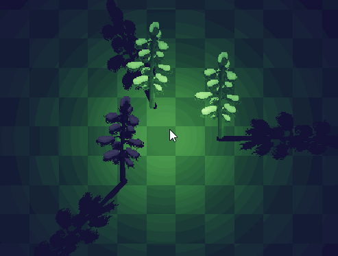

## Crystal Core Functions List <!-- {docsify-ignore} -->

Below are listed all core Constructors and their methods available in Crystal.  
Although the topics are separate, they are all linked in some way.

> Note: Most of the content here is also available offline using GameMaker's Feather. However, there is additional information here.

<br>


# Crystal_Renderer()

`Crystal_Renderer()` is essentially responsible for rendering. Here contains the essential stuff to make the lighting & shadows system work (including PBR rendering).  

The renderer is smart and tries to clean up memory when things are deleted, but you should always run `.Destroy()` in the Clean Up event.  

If you're making a split-screen game, you necessarily need two renderers, one for each view port. And when rendering, you will use different cameras to render content. And you will draw the renderer in its appropriate viewport for each player.  
If you are creating shadow casters, you will have to send each thing to different renderers. You will have to send it more than once, for each one, for example. None of this applies if your game is single player.

```gml
manager = new Crystal_Renderer();
```

<br>


## (GENERAL)

## .Destroy()

Destroy the Renderer from memory. Including vertex shadows vertex buffer, collision buffer and pass surfaces.

```gml
.Destroy();
```

<br>


## (SET)

## .SetCullingEnable()

By default, Crystal disables everything outside of the camera. This function allows you to disable this feature.  

This function enables the culling feature, which allows you to **disable Lights, Materials, and Shadow Casters (dynamics and statics) outside of the camera**. Note that "Material Layers", "Renderables" and other things are not touched, just the mentioned.  

Note that **you still have control** over the individual deactivation of materials and shadows (using the `enabled` variable).  

ALL dynamic lights will be disabled outside of the camera view, excluding Direct lights.  

**If the thing is "Dynamic"**: Culling only disables things when the camera is moving or after the defined time, for performance reasons.  

**If the thing is "Static"**: It regenerates at a certain distance (by default, long). Shadows that are out of range are not generated, optimizing GPU usage for lights that cast shadows.  

> NOTE: This implementation is just a stopgap, unfortunately huge (giant) worlds will suffer if you have too many things going at once, since the loop is performed by all items at once. Unless objects are destroyed and materials, shadows, etc are removed. Quadtrees would probably be more efficient, but this will be investigated in the future. For most games this is sufficient, however.

```gml
.SetCullingEnable(enabled);
```

| Name | Type | Description |  
|-----------|:-----------:|-----------:|  
| enabled | Bool | Defines if culling is enabled. Use -1 to toggle. |  

<br>


## .SetCullingSettings()

Defines the culling settings only.  

```gml
.SetCullingSettings(dynamicsBorderSize, dynamicsMoveDistance, dynamicsAutoUpdateTimer, staticsBorderSize, staticsdynamicsMoveDistance);
```

| Name | Type | Description |  
|-----------|:-----------:|-----------:|  
| dynamicsBorderSize | Real | Sets the distance from the camera's edge at which dynamic stuff will stop from rendering. Default is 200. Increase this if you notice some things disappearing sooner.
| dynamicsMoveDistance | Real | Distance the camera needs to move to update the culling of dynamic things. Default is 10. Useful to avoid constant updates every frame. If the camera teleports, this should work naturally too.
| dynamicsAutoUpdateTimer | Real | The time (in frames) that the culling state should update if the camera is idle (not moving). Dynamics only.
| staticsBorderSize | Real | Sets the distance from the camera's edge at which static stuff will be regenerated and culled. Default is 2500. Increase this if you notice some things disappearing sooner.
| staticsdynamicsMoveDistance | Real | Distance the camera needs to move to update the culling of static things. Default is 250. Useful to avoid constant updates every frame. If the camera teleports, this should work naturally too.


<br>


## .SetMaterialsEnable()

Enable or disable materials rendering of the lighting system. This includes: Normal Maps, Emissive, Reflections and PBR (metallic, roughness and ambient occlusion).
Note that naturally materials are only created when in use, but this function completely disables the feature, as if it did not exist in the lighting system.
This improves performance if you just want to have lights with shadows.  

```gml
.SetMaterialsEnable(enabled);
```

| Name | Type | Description |  
|-----------|:-----------:|-----------:|  
| enabled | Bool | Defines if the material rendering is enabled. Use -1 to toggle. |  

<br>


## .SetShadowsEnable()

Enable or disable vertex and sprite shadows generation, even if you have created shadows. Disabling and then re-enabling this setting will cause the shadows to regenerate.  

This feature can be useful for your game performance options.  

```gml
.SetShadowsEnable(enabled);
```

| Name | Type | Description |  
|-----------|:-----------:|-----------:|  
| enabled | Bool | Defines if the renderer is generating shadows from Crystal. Use -1 to toggle. |  

<br>


## .SetHDREnable()

Enable or disable HDR (High Dynamic Range) in general (including lights). Default is false. Generally recommended to have (if needed), for best visuals. With HDR enabled, the lights can have more contrasting and visually beautiful intensity and you have better control of emissive materials.  

> NOTE: This does not affect, specifically: Normal Maps, Reflections or Materials (Metallic + Roughness + Ambient Occlusion + Mask), since they do not need this feature.  

> This can affect VRAM usage and not every hardware supports this (although, most of the 2015 GPUs above should work).  

> When using HDR, if you want the lights to not be too blown out, **you need to use Tone Mapping** to map the pixels from HDR to LDR (low dynamic range)! This feature is a *post-processing* feature, and is only available in [Post-Processing FX](https://foxyofjungle.itch.io/post-processing-fx) library, or using your own.

With HDR enabled, you can also use emissive materials with emission above 1 (HDR) so that Bloom only glows the emissive pixels.  

To make emissive materials glow, their `emission` value must be greater than the Bloom's `threshold`.  

```gml
.SetHDREnable(enabled);
```

| Name | Type | Description |  
|-----------|:-----------:|-----------:|  
| enabled | Bool | Defines if HDR is enabled. Use -1 to toggle. |  

<br>


## .SetLightsHDREnable()

Enable or Disable HDR lightmap. Default is true. With HDR enabled, the lights can have more contrasting and visually beautiful intensity. When deactivated, light intensities can only go up to 1 clamped.  

If you are bothered by Bloom effects being too bright with overlapping lights, you can keep this disabled.  

```gml
.SetLightsHDREnable(enabled);
```

| Name | Type | Description |  
|-----------|:-----------:|-----------:|  
| enabled | Bool | Defines if Lightmap HDR is enabled. Use -1 to toggle. |  

<br>


## .SetLightsBlendmode()

Sets lights blend mode. 

> WARNING: Blendmode 2 is experimental and may change in future updates.  

```gml
.SetLightsBlendmode(blendMode);
```

| Name | Type | Description |  
|-----------|:-----------:|-----------:|  
| blendMode | Real | Blendmode to blend lights. 0 = Multiply, 1 = Multiply Normalized, 2 = Multiply Linear, 3 = Add. |  

<br>


## .SetLightsIntensity()

Sets intensity of all lights.

> WARNING: `Crystal_TimeCycle` overrides this variable. Use `.SetLightsCompensation()` if you want a fixed value.

```gml
.SetLightsIntensity(intensity);
```

| Name | Type | Description |  
|-----------|:-----------:|-----------:|  
| intensity | Real | Lights intensity. From 0 to 1. 1 is fully lit. |  

<br>


## .SetLightsCompensation()

It works the same as SetLightsIntensity(), but is not influenced by `Crystal_TimeCycle`. By default, the intensity is 3, but 1 is the real default intensity (use 1 if you notice the ultra bright lights). 

```gml
.SetLightsCompensation(intensity);
```

| Name | Type | Description |  
|-----------|:-----------:|-----------:|  
| intensity | Real | Lights intensity. From 0 to 1. 1 is fully lit. |  

<br>


## .SetLightsCollisionEnable()

Enables or disables the generation of lights collision information.

> Only enable this if you actually intend to use it, as there is a high performance cost. Use the `updateTime` setting to slow down the buffer refresh. What explains the high frame time usage of this function is due to the fact that communication between GPU and CPU is always slow.

```gml
.SetLightsCollisionEnable(enabled);
```

| Name | Type | Description |  
|-----------|:-----------:|-----------:|  
| enabled | Bool | Defines if the lightmap is generating collisiong data. |  

<br>


## .SetLightsCollisionSettings()

Defines the lights collision buffer generation settings only.  

```gml
.SetLightsCollisionSettings(updateTime);
```

| Name | Type | Description |  
|-----------|:-----------:|-----------:|  
| updateTime | Real | The time (in frames) that the collision buffer should be updated. |  

<br>


## .SetAmbientColor()

Sets the ambient light color. The default is c_black. The ambient color is on top of the LUT colors (like an overlay).

This does not affect emissive materials.  

```gml
.SetAmbientColor(color);
```

| Name | Type | Description |  
|-----------|:-----------:|-----------:|  
| color | Real,Color | The ambient color. |  

<br>


## .SetAmbientIntensity()

Sets the ambient light intensity. The ambient illumination is mixed after LUT. You can use values greater than 1, but from 0 to 1 is the recommended.  

```gml
.SetAmbientIntensity(intensity);
```

| Name | Type | Description |  
|-----------|:-----------:|-----------:|  
| intensity | Real | The ambient intensity. |  

<br>


## .SetAmbientLUT()

Defines a LUT texture to be used as the ambient light color. A Day & Night Cycle system can override this.  

```gml
.SetAmbientLUT(textureId, type, horizontalSquares);
```

| Name | Type | Description |  
|-----------|:-----------:|-----------:|  
| textureId | Pointer.Texture | Id of the texture to be used as a LUT. Example: sprite_get_texture() or surface_get_texture(). Use undefined or -1 to use the default LUT. |  
| type | Real | The LUT type to be used.  0: Strip, 1: Grid, 2: Hald Grid (Cube). |  
| horizontalSquares | Real | LUT squares. Example: 16 (Strip), 8 (Grid), 8 (Hald Grid). |  

<br>


## .SetSSREnable()

Sets whether to enable Screen-Space Reflections (SSR). With this enabled, you can reflect the scene or sky onto reflective materials

> Only works with BRDF light shaders.  

```gml
.SetSSREnable(enabled);
```

| Name | Type | Description |  
|-----------|:-----------:|-----------:|  
| enabled | Bool | Toggle SSR. Use -1 to toggle. |  

<br>


## .SetSSRSettings()

Defines the screen-space reflections settings only.  

```gml
.SetSSRSettings(ssrIntensity, spriteOrSurface, subimg, color, alpha);
```

| Name | Type | Description |  
|-----------|:-----------:|-----------:|  
| ssrIntensity | Real | Screen-space reflections intensity. 0 to 1. |  
| spriteOrSurface | Asset.GMSprite,Id.Surface | The sprite asset or surface to be used as sky. |  
| subimg | Real | If using a sprite, this is the sky sprite subimg (frame). |  
| color | Color | The sky color. |  
| alpha | Real | The sky alpha. 0 to 1. |  

<br>


## .SetDitheringEnable()

Defines whether the dithering effect for lights and shadows is enabled or not. For performance reasons, dithering is disabled by default at compile time, so you can enable it directly in the shader: "__cle_shDeferredRender", through the "ENABLE_DITHERING" option. This way, you will be able to use this function.  

```gml
.SetDitheringEnable(enabled);
```

| Name | Type | Description |  
|-----------|:-----------:|-----------:|  
| enabled | Bool | Toggle dithering. true or false. Use -1 to toggle. |  

<br>


## .SetDitheringSettings()

Sets the parameters of the dithering effect only.  

```gml
.SetDitheringSettings(threshold, bayerSprite, bayerSpriteSubimg, levels);
```

| Name | Type | Description |  
|-----------|:-----------:|-----------:|  
| threshold | Real | Defines when dithering should be applied. |  
| bayerSprite | Asset.GMSprite | A bayer matrix sprite for the dithering effect. Crystal contains some included in the "Assets" folder. |  
| bayerSpriteSubimg | Real | Bayer sprite subimg (frame). |  
| levels | Real | Posterization level. Recommended 3 - 8 maybe (use what you want). Above 256 it is not noticeable. |  

<br>


## .SetRenderResolution()

Sets the rendering resolution for shadows and lights.  

> WARNING: Changing the render resolution affects the depth buffer (it's not Crystal's fault). So the correct thing to do is to change the input surface resolution directly. This is also valid if you are changing the resolution of individual passes.

```gml
.SetRenderResolution(resolution);
```

| Name | Type | Description |  
|-----------|:-----------:|-----------:|  
| resolution | Real | Resolution, from 0 to 1 (full). |  

<br>


## .SetPassResolution()

Sets the rendering resolution for shadows and lights.  

> WARNING: Changing the pass resolution affects the depth buffer (it's not Crystal's fault). So the correct thing to do is to change the input surface resolution directly.  

```gml
.SetPassResolution(pass, resolution);
```

| Name | Type | Description |  
|-----------|:-----------:|-----------:|  
| pass | Enum.CRYSTAL_PASS | The crystal pass to change the render resolution. |  
| resolution | Real | Resolution, from 0 to 1 (full). |  

<br>


## .SetRenderClass()

Define your own final rendering class with a custom shader for custom effects. 

This is rendered inside the surface of the final pass. 

```gml
.SetRenderClass(renderClass);
```

| Name | Type | Description |  
|-----------|:-----------:|-----------:|  
| renderClass | Struct | The constructor function reference. Must have a "Render" method. "self" is available, with the following parameters too: _surface, _surfaceW, _surfaceH, _camX, _camY, _camW, _camH, _texMaterial, _texLightmap, _texEmissive. |  

Example:
```gml
// Create your rendering class
function MyCoolRendering() constructor {
	variable1 = 5;
	variableB = "Name";
	shaderUniformHere = shader_get_uniform(...);
	
	static Render = function(_surface, _surfaceW, _surfaceH, _camX, _camY, _camW, _camH, _texMaterial, _texLightmap, _texEmissive) {
		// < self is available here - so you can access Crystal_Renderer variables and methods here >
		var _normalsSurface = GetPassSurface(CRYSTAL_PASS.NORMALS);

		// draw input surface
		// shader_set();
		draw_surface_stretched_ext(_surface, 0, 0, _surfaceW, _surfaceH, c_red, 1);
		// shader_reset();
	}
}

// Define rendering class
renderer.SetRenderClass(MyCoolRendering);
```


<br>


## .SetRenderEnable()

Toggle renderer rendering. If disabled, nothing will be rendered to the surfaces internally (including shadows), and `.GetRenderSurface()` will return the input surface (e.g: `application_surface`).  

```gml
.SetRenderEnable(enabled, clearMemory);
```

| Name | Type | Description |  
|-----------|:-----------:|-----------:|  
| enabled | Bool | Toggle rendering. true or false. Use -1 to toggle. |  
| clearMemory | Bool | If true and "enabled" is false, cleans all internal surfaces from VRAM. |  

<br>


## .SetDrawEnable()

Toggle renderer drawing. If disabled, the lighting system will not draw the final surface, but will still continue rendering.

> You MUST disable this if you are using post-processing, since it is the post-processing that must draw the final surface.

```gml
.SetDrawEnable(enabled, clearMemory);
```

| Name | Type | Description |  
|-----------|:-----------:|-----------:|  
| enabled | Bool | Toggle drawing. true or false. Use -1 to toggle. |  
| clearMemory | Bool | If true and "enabled" is false, cleans all internal surfaces from VRAM. |  

<br>


## (GET)

## .GetPassSurface()

Use this function to get the surface of some render pass. 

```gml
.GetPassSurface(pass) -> Id.GMSurface;
```

| Name | Type | Description |  
|-----------|:-----------:|-----------:|  
| pass | Enum.CRYSTAL_PASS | The pass you want to access to get the surface. |  

<br>


## .GetPassResolution()

Use this function to get the render resolution of some render pass. A value from 0 to 1. 

```gml
.GetPassResolution(pass) -> Real;
```

| Name | Type | Description |  
|-----------|:-----------:|-----------:|  
| pass | Enum.CRYSTAL_PASS | The pass you want to access to get the surface. |  

<br>


## .GetRenderSurface()

Gets the final surface of the lighting system. Useful for using this as input surface for post-processing. 

```gml
.GetRenderSurface() -> Id.GMSurface;
```

<br>


## .GetRenderResolution()

Gets the overall render resolution. A value from 0 to 1.  

```gml
.GetRenderResolution() -> Real;
```

<br>


## .GetAmbientColor()

Gets the ambient color.  

```gml
.GetAmbientColor() -> Color;
```

<br>


## .GetAmbientIntensity()

Gets the ambient intensity. A value from 0 to 1.  

```gml
.GetAmbientIntensity() -> Real;
```

<br>


## .GetAmbientLUTTexture()

Gets the current ambient LUT texture. 

```gml
.GetAmbientLUTTexture() -> Id.GMTexture;
```

<br>


## .GetLightsBlendmode()

Gets the current Lights Blendmode. 

```gml
.GetLightsBlendmode() -> Real;
```

<br>


## .GetLightsIntensity()

Gets the current lights intensity. 

```gml
.GetLightsIntensity() -> Real;
```

<br>


## .GetLightsCollisionAt()

With this function you can get the light pixel color (in screen-space) at the selected position (in world-space).  

The color is NOT influenced by ambient light. This means that, for example, even if your ambient light is blue, where there is no light it will be black. 

> This function is fast, so you can call multiple times without worrying. 

```gml
.GetLightsCollisionAt(xPosition, yPosition) -> Color;
```

| Name | Type | Description |  
|-----------|:-----------:|-----------:|  
| xPosition | Real | The x position (in the room) to check for collision. |  
| yPosition | Real | The y position (in the room) to check for collision. |  

Example:

```gml
// Get pixel color at instance position
var _lightColor = lightingObject.renderer.GetLightsCollisionAt(x, y);

// change spotted variable if pixel brightness is larger than 40
spotted = color_get_value(_lightColor) > 40;
```

> Tip: you can use crystal_get_renderer() to get the latest available renderer.

<br>


## .IsMaterialsEnabled()

Returns if Materials are enabled. 

```gml
.IsMaterialsEnabled() -> Real;
```

<br>


## .IsHDREnabled()

Returns if HDR is enabled. 

```gml
.IsHDREnabled() -> Real;
```

<br>


## .IsHDRLightmapEnabled()

Returns if HDR Lightmap is enabled. 

```gml
.IsHDRLightmapEnabled() -> Real;
```

<br>


## .IsCullingEnabled()

Returns if Culling is enabled. 

```gml
.IsCullingEnabled() -> Real;
```

<br>


## .IsDitheringEnabled()

Returns if Dithering is enabled. 

```gml
.IsDitheringEnabled() -> Real;
```

<br>


## .IsLightsCollisionEnabled()

Returns if lights collision generation is enabled.

```gml
.IsLightsCollisionEnabled() -> Real;
```

<br>


## (RENDER + DRAW) 

## .PreRender()

This function MUST be executed exclusively in the **Begin Step** event. Because of the internal GameMaker execution order, some things may not work correctly outside of this event.  

This function just resets some renderer variables. It doesn't do anything else. This function **is not** using surface_set_target and anything involving graphics.  

```gml
.PreRender();
```

<br>


## .Render()

Renderize lights, shadows, materials and other things on the internal Crystal surface, which is a copy from the input `surface`. It should be executed after the Draw event, like "Draw End" (recommended). You can render in Draw event, but it is not necessary since Crystal has unlit pass and other features, like Direct lights. 

**Supported cameras:** Default and created via matrix functions (orthographic only).

```gml
.Render(surface, camera); -> Id.Surface
```

| Name | Type | Description |  
|-----------|:-----------:|-----------:|  
| surface | Id.Surface | The input surface to renderize from (example: `application_surface`). |  
| camera | Id.Camera | The camera pointing the place in world to render from. |  


<br>


## .Draw()

This function draws the lighting renderer's final surface using custom position and size. Can be drawn on any Draw event. May be useful for split-screen games too.  

It's also possible to get the final surface with `.GetRenderSurface()` and draw the surface manually.

```gml
.Draw(x, y, w, h); -> Id.Surface
```

| Name | Type | Description |  
|-----------|:-----------:|-----------:|  
| x | Real | X position where to draw the final surface. |  
| y | Real | Y position where to draw the final surface. |  
| x | Real | Width of the area to be drawn final surface. |  
| y | Real | Height of the area to be drawn final surface. |  

<br>


## .DrawInFullscreen()

Easily draw Lighting renderer's final surface in full screen. It is an easy alternative to the normal `.Draw()` method.  

This function automatically detects the draw event you are drawing (Post-Draw or Draw GUI Begin).  

It uses the size of the referenced surface for internal rendering resolution (example: `application_surface` size).  

> If you are using Post-Processing, you should NOT use this function, but rather use post-processing itself to draw.  

> NOTE: Do not try to apply a shader when using this function, because internally several shaders are already being applied, so this does not work. Use a Render class instead (look at `.SetRenderClass()`).

```gml
.DrawInFullscreen(); -> Id.Surface
```

<br><br>


# Crystal_Shadow()

`Crystal_Shadow()` is an area where light will be blocked and shadows will be projected. This shadow is vertex-based. You can move and rotate the shadow by accessing its variables. 

Static shadows are MUCH more efficient, useful for scenarios. Use dynamic shadows for things that move, but be careful with performance. 

The `owner` is used exclusively to get the initial depth, rotation and scale from the instance (if exists). If you want to update it later, it must be done manually.

```gml
shadow = new Crystal_Shadow(owner, shadowType, transformMode);
```

| Name | Type | Description |  
|-----------|:-----------:|-----------:|  
| owner | Id.Instance,Struct | The instance to get default properties. Use noone if you want to use default properties (position, angle and depth: 0, scale: 1). |  
| shadowType | Enum.CRYSTAL_SHADOW | Shadow type enum. Example: CRYSTAL_SHADOW.STATIC. |  
| transformMode | Macro | Shadow transformation mode. Default: SHADOW_SOFT_TRANSFORMED. Changing this influences performance: soft shadows require more CPU to build vertices. |  

**Public Variables:**

| Name | Type | Description |  
|-----------|:-----------:|-----------:|  
| enabled | Bool | Activate or deactivate shadow without destroying it. |  
| x | Real | The shadow x position. |  
| y | Real | The shadow y position. |  
| depth | Real | The shadow depth. |  
| xScale | Real | The shadow x scale. You can use image_xscale here, for example. |  
| yScale | Real | The shadow y scale. You can use image_yscale here, for example. |  
| angle | Real | The shadow rotation angle (0-360). |  
| frame | Real | The shadow frame, used for animated shadows. |  
| frameCount | Real | (Read-Only) The frame count. |  
| shadowLength | Real | The shadow projection length. |  

Example:

```gml
shadow = new Crystal_Shadow(id, CRYSTAL_SHADOW.STATIC);
shadow.AddMesh(new Crystal_ShadowMesh().FromSpriteRect(sprite_index));
shadow.Apply();

shadow.angle = 45;
```

> Don’t forget to use .Apply(), otherwise the shadow will not be created!

<br>


## .Destroy()

Remove this shadow caster from the `Crystal_Renderer()` that the shadow was added. Use this when destroying objects that cast shadows. 

> Even if the shadow is static, it will be removed (this will cause static shadows to be regenerated, which means you should avoid it). 

```gml
.Destroy();
```

<br>


## .Apply()

Apply shadow caster, adding it to a Crystal_Renderer(). If not specified, adds to the last created renderer (or set with `crystal_set_renderer()`). 

```gml
.Apply([renderer]);
```

| Name | Type | Description |  
|-----------|:-----------:|-----------:|  
| renderer | Struct.Crystal_Renderer | The renderer to add the group for rendering. If not specified, adds to the last created renderer (or set with crystal_set_renderer()). |  

<br>


## .AddMesh()

Associate a mesh with a frame. Useful for animated vertex shadows. Use -1 to increment the frame with each function call.

```gml
.AddMesh(mesh, frame);
```

| Name | Type | Description |  
|-----------|:-----------:|-----------:|  
| mesh | Struct.Crystal_ShadowMesh | The mesh to associate to the frame. |  

<br>


## .AddMeshes()

Add previously created meshes from an array. Each array position is a frame, counting from 0. 

```gml
.AddMeshes(meshesArray);
```

| Name | Type | Description |  
|-----------|:-----------:|-----------:|  
| meshesArray | Array<Struct.Crystal_ShadowMesh> | The array of meshes to copy from. |  

Example:

```gml
shadow = new Crystal_Shadow(id, CRYSTAL_SHADOW.DYNAMIC);
shadow.AddMeshes([
	new Crystal_ShadowMesh().FromJson("[[-7,-10],[1,-9],[15,-22],[19,-22],[26,-15],[25,-11],[26,-7],[13,-2],[17,5],[17,18],[16,20],[14,22],[12,23],[6,23],[3,22],[0,18],[-3,9],[-6,13],[-17,13],[-20,16],[-23,13],[-23,7],[-24,0],[-21,-8],[-27,-15],[-23,-20],[-16,-22]]"),
	new Crystal_ShadowMesh().FromJson("[[-11,-14],[2,-13],[23,-18],[27,-17],[28,-13],[29,-9],[29,-5],[28,-3],[27,0],[19,0],[20,12],[18,17],[14,20],[7,20],[3,16],[2,11],[-2,8],[-5,10],[-10,11],[-15,10],[-18,12],[-22,9],[-19,6],[-22,3],[-22,-5],[-29,-9],[-26,-16],[-21,-20]]")
]);
shadow.shadowLength = 0.5;
shadow.Apply();
```

<br>


## .AddMeshesFromSprite()

Add meshes based on the shape of a sprite (**sprite tracing**).  


If the sprite has multiple frames (subimgs), each frame will be a shadow mesh - creating an animated shadow.  

> NOTE: Only works from GameMaker runtime v2024.14+.

> WARNING: Doesn't work well with concave or square shapes. It may eventually generate more vertices than needed, which may affect performance, as opposed to defining the vertices manually.

```gml
.AddMeshesFromSprite(sprite, maxPoints);
```

| Name | Type | Description |  
|-----------|:-----------:|-----------:|  
| sprite | Asset.GMSprite | The sprite to generate vertices from. |  
| maxPoints | Real | The maximum amount of points to generate. Default is 32. |  

Example:

```gml
shadow = new Crystal_Shadow(id, CRYSTAL_SHADOW.STATIC);
shadow.AddMeshesFromSprite(sprite_index);
shadow.shadowLength = 1;
shadow.Apply();
```

<br>


## .RemoveMeshes()

Remove all meshes references from this shadow caster. 

```gml
.RemoveMeshes();
```

<br>


## .SyncToOwner()

This function synchronizes "transforms" (position, rotation, scale) and "depth" variables to the "owner" instance (if defined) - built-in variables.  

This should be called every frame.  

```gml
.SyncToOwner();
```

Example:

```gml
shadow.SyncToOwner();
```

<br><br>


# Crystal_ShadowMesh()

`Crystal_ShadowMesh()` is a local-space mesh to be used as a frame for a shadow caster. This should be added to a `Crystal_Shadow()`. 

> NOTE: This struct only contains an array of points, which are garbage collected, so you don't need to destroy it. The vertex buffer generation occurs in the Crystal_Renderer() itself.

```gml
mesh = new Crystal_ShadowMesh();
mesh.FromSpriteRect(sprite_index);
// or
mesh = new Crystal_ShadowMesh().FromSpriteRect(sprite_index);
```

**Creating meshes:**

Crystal doesn't have a visual shadow editor yet, but you can use [this one](https://web.archive.org/web/20240712103410/https://adriano-t.github.io/meshgen/), which is compatible with Crystal. To use the generated points, you'll use `.FromJson()`, for example: 

```gml
shadow = new Crystal_Shadow(id, CRYSTAL_SHADOW.DYNAMIC);
shadow.AddMeshes([
	new Crystal_ShadowMesh().FromJson("[[-7,-10],[1,-9],[15,-22],[19,-22],[26,-15],[25,-11],[26,-7],[13,-2],[17,5],[17,18],[16,20],[14,22],[12,23],[6,23],[3,22],[0,18],[-3,9],[-6,13],[-17,13],[-20,16],[-23,13],[-23,7],[-24,0],[-21,-8],[-27,-15],[-23,-20],[-16,-22]]"),
	new Crystal_ShadowMesh().FromJson("[[-11,-14],[2,-13],[23,-18],[27,-17],[28,-13],[29,-9],[29,-5],[28,-3],[27,0],[19,0],[20,12],[18,17],[14,20],[7,20],[3,16],[2,11],[-2,8],[-5,10],[-10,11],[-15,10],[-18,12],[-22,9],[-19,6],[-22,3],[-22,-5],[-29,-9],[-26,-16],[-21,-20]]")
]);
shadow.shadowLength = 0.5;
shadow.Apply();
```

<br>


## .AddEdge()

Add edges to the mesh. Edges are lines with two points/positions.

> Edges should be added in clockwise direction.


```gml
.AddEdge(x1, y1, x2, y2);
```

| Name | Type | Description |  
|-----------|:-----------:|-----------:|  
| x1 | Real | X position of the first point. |  
| y1 | Real | Y position of the first point. |  
| x2 | Real | X position of the second point. |  
| y2 | Real | Y position of the second point. |  

Example:  
Adding 2 line segments:

```gml
mesh = new Crystal_ShadowMesh();
mesh.AddEdge(10, 10, 200, 10);
mesh.AddEdge(200, 10, 200, 100);
```

<br>


## .ClearEdges()

Remove all edges of a Crystal_Shadow().

```gml
.ClearEdges();
```

<br>


## .FromPath()

Creates a polygon based on path points. The rotation and scale are from the `Crystal_Shadow()` itself.

```gml
.FromPath(pathAsset) -> Struct.Crystal_ShadowMesh;
```

| Name | Type | Description |  
|-----------|:-----------:|-----------:|  
| pathAsset | Asset.GMPath | The path asset index. |  

<br>


## .FromJson()

Creates a polygon based on path points. The rotation and scale are from the `Crystal_Shadow()` itself.  

```gml
.FromJson(jsonString, closed) -> Struct.Crystal_ShadowMesh;
```

| Name | Type | Description |  
|-----------|:-----------:|-----------:|  
| jsonString | String | The JSON string to parse points from. The format must be like this: `"[[-7,-10],[1,-9],[15,-22]]"` (a JSON string with an array of [x, y] points). |  
| closed | Bool | If true, connect the last vertex with the first vertex. |  

<br>


## .FromArray()

Creates a polygon based on an array of sequencial x and y. The rotation and scale are from the `Crystal_Shadow()` itself.

```gml
.FromArray(array) -> Struct.Crystal_ShadowMesh;
```

| Name | Type | Description |  
|-----------|:-----------:|-----------:|  
| array | Array | The array with points sequencially. Example: `[x, y, x, y, x, y...]` |  

<br>


## .FromSpriteConvexHull()

Creates a polygon based on the sprite convex hull (sprite tracing). The rotation and scale are from the `Crystal_Shadow()` itself.

```gml
.FromSpriteConvexHull(sprite, subimg, maxPoints) -> Struct.Crystal_ShadowMesh;
```

| Name | Type | Description |  
|-----------|:-----------:|-----------:|  
| sprite | Asset.GMSprite | The sprite asset to generate vertex points from.  |  
| subimg | Real | The sprite subimg (frame).  |  
| maxPoints | Real | The maximum number of points allowed. 32 is a good number for performance reasons.  |  

<br>


## .FromConvexHull()

Creates a polygon based on a previously created convex hull (sprite tracing using `sprite_get_convex_hull()`). The rotation and scale are from the `Crystal_Shadow()` itself.

```gml
.FromConvexHull(convexHull) -> Struct.Crystal_ShadowMesh;
```

| Name | Type | Description |  
|-----------|:-----------:|-----------:|  
| convexHull | Array | The array with points created with `sprite_get_convex_hull()`.  |  

<br>


## .FromRect()

Creates a polygon based on a rectangle shape. The rotation and scale are from the `Crystal_Shadow()` itself.

```gml
.FromRect(width, height, isCentered) -> Struct.Crystal_ShadowMesh;
```

| Name | Type | Description |  
|-----------|:-----------:|-----------:|  
| width | Real | The shape width. |  
| height | Real | The shape height. |  
| isCentered | Bool | If true, the rectangle will be centered. |  

<br>


## .FromCircle()

Creates a polygon based on a circle shape. The rotation and scale are from the `Crystal_Shadow()` itself.

```gml
.FromCircle(radius, isCentered, edges) -> Struct.Crystal_ShadowMesh;
```

| Name | Type | Description |  
|-----------|:-----------:|-----------:|  
| radius | Real | The shape width. |  
| isCentered | Bool | If true, the rectangle will be centered. |  
| edges | Real | Circle precision. Min 3 edges. |  

<br>


## .FromEllipse()

Creates a polygon based on an ellipse shape. The rotation and scale are from the `Crystal_Shadow()` itself.

```gml
.FromEllipse(width, height, isCentered, edges) -> Struct.Crystal_ShadowMesh;
```

| Name | Type | Description |  
|-----------|:-----------:|-----------:|  
| width | Real | The shape width. |  
| height | Real | The shape height. |  
| isCentered | Bool | If true, the ellipse will be centered. |  
| edges | Real | Ellipse precision. Min 3 edges. |  

<br>


## .FromSpriteRect()

Creates a rectangle polygon based on a sprite size. Tip: `sprite_index`. The rotation and scale are from the `Crystal_Shadow()` itself.

```gml
.FromSpriteRect(sprite, padding) -> Struct.Crystal_ShadowMesh;
```

| Name | Type | Description |  
|-----------|:-----------:|-----------:|  
| sprite | Asset.GMSprite | The sprite asset to generate a rectangle based on the sprite size and offset. |  
| padding | Real | Additional offset. Positive = inner. |  

<br>


## .FromSpriteEllipse()

Creates a ellipse polygon based on a sprite size. Tip: `sprite_index`. The rotation and scale are from the `Crystal_Shadow()` itself.

```gml
.FromSpriteEllipse(sprite, padding, edges) -> Struct.Crystal_ShadowMesh;
```

| Name | Type | Description |  
|-----------|:-----------:|-----------:|  
| sprite | Asset.GMSprite | The sprite asset to generate an ellipse based on the sprite size and offset. |  
| padding | Real | Additional offset. Positive = inner. |  
| edges | Real | Ellipse precision. Min 3 edges. |  

<br>


## .FromSpriteBBoxRect()

Creates a polygon based on a sprite bounding box (bbox). The rotation and scale are from the `Crystal_Shadow()` itself.

The pivot point is taken into account.

```gml
.FromSpriteBBoxRect(sprite, padding) -> Struct.Crystal_ShadowMesh;
```

| Name | Type | Description |  
|-----------|:-----------:|-----------:|  
| sprite | Asset.GMSprite | The sprite asset to generate a rectangle based on the sprite size and offset. |  
| padding | Real | Additional offset. Positive = inner. |  

<br>


## .FromSpriteBBoxEllipse()

Creates a polygon based on a sprite bounding box (bbox), with ellipse shape. The rotation and scale are from the `Crystal_Shadow()` itself.

The pivot point is taken into account.

```gml
.FromSpriteBBoxEllipse(sprite, padding, edges) -> Struct.Crystal_ShadowMesh;
```

| Name | Type | Description |  
|-----------|:-----------:|-----------:|  
| sprite | Asset.GMSprite | The sprite asset to generate a rectangle based on the sprite size and offset. |  
| padding | Real | Additional offset. Positive = inner. |  
| edges | Real | Ellipse precision. Min 3 edges. |  

<br>


# Crystal_ShadowSprite()

Creates a sprite-type shadow. A shadow is where it says where light will be blocked. Note that sprite shadows can be either high-resolution (with smooth/gradient edges) or pixel-rt sprites.

Static shadows are MUCH more efficient, useful for scenarios. Use dynamic shadows for things that move, but be careful with performance. 

The `owner` is used exclusively to get the initial depth, rotation and scale from the instance (if exists). If you want to update it later, it must be done manually.

> IMPORTANT: To see sprite shadows, you need to change the `shadowShaderType` (from a light that cast shadows) to `LIGHT_SHADOW_SHADER_SPRITE_SMOOTH`, for example.

> TIP: The shadow sprite doesn't necessarily have to be the same as the instance's! You can define a different one that has a blur, for example. If you choose the same sprite as the instance, the shader will automatically turn it black.

```gml
shadow = new Crystal_ShadowSprite(owner, sprite, frame, shadowType);
```

| Name | Type | Description |  
|-----------|:-----------:|-----------:|  
| owner | Id.Instance,Struct | The instance to get default properties. Use noone if you want to use default properties (position, angle and depth: 0, scale: 1). | 
| sprite | Asset.GMSprite |  The sprite to be used as shadow. |  
| frame | Real | The sprite subimg (frame). |  
| shadowType | Enum.CRYSTAL_SHADOW | Shadow type enum. Example: CRYSTAL_SHADOW.STATIC. |  

**Public Variables:**

| Name | Type | Description |  
|-----------|:-----------:|-----------:|  
| enabled | Bool | Activate or deactivate shadow without destroying it. |  
| x | Real | The shadow x position. |  
| y | Real | The shadow y position. |  
| depth | Real | The shadow depth. |  
| angle | Real | The shadow rotation angle (0-360). Tip: This angle is taken into account when moving the light. Default is 0. |  
| xScale | Real | The shadow x scale. You can use image_xscale here, for example. |  
| yScale | Real | The shadow y scale. You can use image_yscale here, for example. |  
| sprite | Asset.GMSprite | The shadow sprite. |  
| frame | Real | The shadow frame, used for animated shadows. |  
| shadowLength | Real | The shadow projection length. If the shadow does offset, numbers close to 0 will prevent the shadow from moving too much with the light. 1 = same distance as the light. Default is 1. |  
| followLightAngle | Bool | If `true`, the shadow sprite will rotate according to the light's position. If `false`, it will not rotate based on the light position. |  
| fixedBase | Bool | If `true`, the shadow sprite will not offset from the position, OR, if `followLightAngle` is `false`, the bottom vertices of the shadow sprite will remain fixed and will not rotate. |  

> Don’t forget to use .Apply(), otherwise the shadow will not be created!

Usage examples:

**Trees (Rotate with light + do not offset):**



```gml
shadow = new Crystal_ShadowSprite(id, sprite_index, image_index, CRYSTAL_SHADOW.STATIC);
shadow.shadowLength = 1;
shadow.fixedBase = true; // the shadow will not offset
shadow.followLightAngle = true; // the shadow will rotate based on the light position
shadow.Apply();
```
</br>


**Objects on the ground (Offset shadows):**

> NOTE: Be careful if you have Direct Lights that have very large shadow scattering, as the shadow may move very far and seems to disappear, which is not the case.

| Same sprite | Different sprite for the shadow |  
|---|---|  
| |    |  

```gml
shadow = new Crystal_ShadowSprite(id, sprite_index, image_index, CRYSTAL_SHADOW.STATIC);
shadow.shadowLength = 0.1; // Numbers close to 0 will prevent the shadow from moving too much with the light. 1 = same distance as the light.
shadow.fixedBase = false; // The shadow WILL offset
shadow.followLightAngle = false; // The shadow will NOT rotate based on the light position
shadow.Apply();
```
</br>


**Projected shadows (Fixed base):**

Note that if shadows are cast this way, the fixed vertices will **always** be the bottom ones, so if the sprite's offset isn't bottom-center, the sprite will flip strangely. You can disable sprite shadow flipping (both vertically and horizontally) in the fragment shader: `__cle_shSpriteShadow` (Use CTRL + T to search). NOTE: This will disable the behavior for all sprite shadows, since the shader is used by all of them.

This _may_ be improved in the future, but I haven't found a better solution for this yet.


```gml
shadow = new Crystal_ShadowSprite(id, sprite_index, image_index, CRYSTAL_SHADOW.STATIC);
shadow.shadowLength = 1;
shadow.fixedBase = true; // this will fix the bottom vertices of the shadow sprite
shadow.followLightAngle = false; // the shadow will NOT rotate based on the light position
shadow.Apply();
```

<br>


## .Destroy()

Remove this shadow caster from the `Crystal_Renderer()` that the shadow was added. Use this when destroying objects that cast shadows. 

> Even if the shadow is static, it will be removed (this will cause static shadows to be regenerated, which means you should avoid doing this often). 

```gml
.Destroy();
```

<br>


## .Apply()

Apply shadow caster, adding it to a Crystal_Renderer(). If not specified, adds to the last created renderer (or set with `crystal_set_renderer()`). 

```gml
.Apply([renderer]);
```

| Name | Type | Description |  
|-----------|:-----------:|-----------:|  
| renderer | Struct.Crystal_Renderer | The renderer to add the group for rendering. If not specified, adds to the last created renderer (or set with crystal_set_renderer()). |  

<br>


# Crystal_Material()

`Crystal_Material()` refers to the properties of an object's surface.

Note that this is optional, you will only need materials if you want to achieve the following effects: Normal Map, Emissive, Unlit, Metallic, Roughness, Ambient Occlusion, Reflections and Light Mask.

Roughness controls the blur of the specular light (and reflections), and metallic controls the reflection, and this works best with BRDF light shader. 

Normal maps only work with Phong or BRDF light shader.


**Public Variables**

| Name | Type | Description |  
|-----------|:-----------:|-----------:|  
| enabled | Bool | Activate or deactivate material without destroying it. |  
| isBitmap | Bool | Use true for bitmap, and false for Spine sprites (skeleton). |  
| x | Real | The material x position. |  
| y | Real | The material y position. |  
| depth | Real | The material depth. |  
| xScale | Real | The material x scale. You can use image_xscale here, for example. |  
| yScale | Real | The material y scale. You can use image_yscale here, for example. |  
| angle | Real | The material rotation angle (0-360). |  
| normalSprite | Id.GMSprite | Normal map sprite. Phong and BRDF. Colors: Xright = Red, Yup = Green, zCenter = Blue |  
| emissiveSprite | Id.GMSprite | Emissive sprite. RGBA. |  
| metallicSprite | Id.GMSprite | Metallic sprite. Grayscale. Used on BRDF (metal and reflection intensity). Black = None, White = Full. |  
| roughnessSprite | Id.GMSprite | Roughness sprite. Grayscale. Used on BRDF (shininess and reflection intensity) and Phong (shininess). Black = None, White = Full. |  
| aoSprite | Id.GMSprite | Ambient Occlusion sprite. Grayscale. Multiplied with Albedo. White = None, Black = Occluded. |  
| reflectionSprite | Id.GMSprite | Reflection sprite. RGBA. BRDF only. |  
| maskSprite | Id.GMSprite | Mask sprite. (NOT IMPLEMENTED YET) |  
| emissiveIntensity | Id.GMSprite | Emissive sprite alpha (0 - 1). |  
| normalIntensity | Id.GMSprite | Normal sprite alpha (0 - 1). |  
| metallicIntensity | Id.GMSprite | Metallic sprite alpha (0 - 1). |  
| roughnessIntensity | Id.GMSprite | Roughness sprite alpha (0 - 1). |  
| aoIntensity | Id.GMSprite | Ambient Occlusion sprite alpha (0 - 1). |  
| emission | Real | The emissive sprite emission. Useful to make the sprite glow with Bloom. Values greater than Bloom's `threshold` will glow. Example: Emission is 2.2 and Bloom's threshold is 1.5. |  

> All those that have "intensity" in the name actually refer to the sprite's alpha.

```gml
material = new Crystal_Material(id);
material.emissiveSprite = sprite_index;
material.emissiveSpriteSubimg = 1;
material.Apply();
```

> Sprites will only be rendered if you set them as above before calling .Apply();  

> Emissive sprites are not affected by ambient light. Useful for things that glow in the dark.  

> Don’t forget to use .Apply(), otherwise the material will not be created!  


**Material preview:**


Roughness: 0 = full reflective (only if metallic > 0).  
Metallic: 1 = full reflective.

If you want it to be completely reflective, for example, use a completely white sprite for `metallicSprite`.

By default, these are the default material values (when not assigning a sprite):  

**Metallic: 0**  
**Roughness: 0**  
**Ao: 1**  


(This test took place in real time, but what defines this is the appearance of the sprite itself used in the material. You may want to use some extension like GMLive to view the sprite edit in real time.)


*Bomb sprite used as demo, copyrights belong to their respective owners.*

> Note: By default, roughness blur is disabled for performance, but you can enable it in the BRDF fragment shader for lights. Search for "BLUR_ROUGHNESS" and uncomment it.

> If your albedo sprite has alpha, your Material sprites (like normal map) must have alpha too, otherwise the normal map will not be able to overlap with other sprites correctly, as expected (because it is opaque).

<br>


## .Destroy()

Destroys the material from the `Crystal_Renderer()`. You should call this when the instance is destroyed, for example. Useful for the Clean-Up Event. 

> You can call .Apply() again after calling this function, and the material will be sent to the renderer again. 

```gml
.Destroy();
```

<br>


## .Apply()

Call this after setting up the material and it will be sent to the last created renderer (or set with `crystal_set_renderer()`). 

```gml
.Apply([renderer]);
```

| Name | Type | Description |  
|-----------|:-----------:|-----------:|  
| renderer | Struct.Crystal_Renderer | The renderer to add the material for rendering. If not specified, adds to the last created renderer (or set with crystal_set_renderer()). |  

<br>


## .FromSprite()

Sets Material sprites based on the referenced sprite's name. This makes the workflow faster.  

For example, if you have a sprite named `sprPlayer`, this function will look for sprites with the suffixes, and will automatically set the sprites, based on it:

* `sprPlayerNormal`
* `sprPlayerEmissive`
* `sprPlayerMetallic`
* `sprPlayerRoughness`...

You don't need to add all types, just the ones you're going to use. The function only adds if the sprite was found.  

The following suffixes will be taken into account: "normal", "emissive", "metallic", "roughness", "ao", "reflection", "mask" (to-do).  

> You can define **your own custom suffixes** in the **Crystal Settings** script.  

```gml
.FromSprite([sprite]);
```

| Name | Type | Description |  
|-----------|:-----------:|-----------:|  
| sprite | Asset.GMSprite,undefined | The sprite to get other sprites based on the name. Example: `sprite_index`. Use `undefined` or nothing to use the `sprite_index` from "`owner`". |  

<br>


## .FromSpriteFrames()

Sets Material sprites based on the referenced sprite's frames. This function takes into account frame `0` being the albedo (default). Use `1` in each parameter to tell whether the sprite frame in question exists in the sprite. The frame is incremented sequentially.  

The order of sprite frames is the order of parameters.  

This should be called every frame.  

```gml
.FromSpriteFrames(sprite, normal, emissive, metallic, roughness, ao, mask, reflection);
```

Example:  
Normal map, emissive and ao:

```gml
material.FromSpriteFrames(, 1, 1,,, 1);
```

<br>


## .SyncToOwner()

This function synchronizes "transforms" (position, rotation, scale), alpha/intensity and "depth" variables to the "owner" instance (if defined) - built-in variables.  

This should be called every frame.  

```gml
.SyncToOwner();
```

Example:

```gml
material.SyncToOwner();
```

<br>


## .SyncFrame()

With this function, it is possible to synchronize the frame of all material sprites **(bitmap only)** with the specified value. Useful for animated PBR objects. 

Note that you assume that the frame sequence of the associated sprites is synchronized to the same frame index. 

```gml
.SyncFrame();
```

Example:

```gml
material.SyncFrame(image_index);
```

<br>


## .SyncAnimation()

This function will synchronize the drawing of the Spine skeleton animation with the animation of the current context instance. You can also use `animName` and `skinName` variables for this. 

Only useful for **Spine skeleton sprites**.

> You should call this every frame, like the **Step Event**, if you want the material's animation (normal map, emissive, etc) to sync with the object's animation.

```gml
.SyncAnimation(animation, skin);
```

| Name | Type | Description |  
|-----------|:-----------:|-----------:|  
| animation | String | The Spine sprite animation name. |  
| skin | String | The Spine sprite skin name. |  

Example:

```gml
material.SyncAnimation(skeleton_animation_get(), skeleton_skin_get());
```

<br>


## .SyncAnimationTime()

This function synchronizes the Spine skeleton animation frame with the current context instance. If you want to have control over the normalized position (0-1) of the animation, use `animTime` variable directly from the material.

Only useful for **Spine skeleton sprites**.

> You should call this every frame, like the **Step Event**, if you want the material's animation (normal map, emissive, etc) to sync with the object's animation.

```gml
.SyncAnimationTime(position, duration);
```

| Name | Type | Description |  
|-----------|:-----------:|-----------:|  
| position | Real | The animation position. You can use skeleton_animation_get_position(0). |  
| duration | Real | The animation duration. You can use skeleton_animation_get_duration(); |  

Example:

```gml
var _animPos = skeleton_animation_get_position(0);
var _animDuration = skeleton_animation_get_duration(skeleton_animation_get());
material.SyncAnimationTime(_animPos, _animDuration);
```

<br>


## .IsApplied()

Returns a boolean indicating whether the material is already applied (if .Apply() was called). 

```gml
.IsApplied();
```

<br>


# Crystal_MaterialLayer()

`Crystal_MaterialLayer()` refers to the properties of an object's surface.  

**Public Variables**

| Name | Type | Description |  
|-----------|:-----------:|-----------:|  
| depth | Real | The material drawing depth, containing its layers. |  
| emission | Real | The material surface emission. Default is `1`. Values ​​above the Bloom threshold will emit glow. Useful for emissive particles in layers. |  

Having a lot of `Crystal_Material` can be cumbersome, especially if you need a lot of them for the scene. That's why this layer renderer exists, to render an entire layer as a material. Useful for scenes (also supports dynamic stuff). 

Any type of layer is supported: backgrounds, assets, instances, etc. 

You can add MULTIPLE room layers to this renderer, and they will be rendered inside a single surface. 

This material layer creates a surface, containing the layers inside. 

Adding layers of different depths will cause them to be inside the surface, where the depth of the surface will be taken into account (the depth of the layers will only be used to reorder the drawing of each layer individually, inside the material's surface). 

The `depth` of this material defines the drawing depth of the material surface, which contains **all** rendered layers of this material. Each individual layer is drawn at its own depth, despite being within the surface (useful for individual layer ordering).

For **EACH CRYSTAL_PASS**: NORMALS, MATERIAL, LIGHT, EMISSIVE... you need a **DIFFERENT** `Crystal_MaterialLayer`, which will be sent to the `Crystal_Renderer()` when tou call `.Apply()`.

When using "MATERIAL" pass, you can embed Metallic, Roughness and AO in the same `Crystal_MaterialLayer()`, using the parameters from `.AddLayers()`.

If you need to change the drawing depth from **one range to another**, you need to create another `Crystal_MaterialLayer()`.

Example:

- NormalsA
- NormalsB
- Grass
- NormalsC
- NormalsD

In the example above, you will need two `Crystal_MaterialLayer()`, because there is an unrelated layer (Grass). If I added all the "Normals" layers together, I wouldn't be able to render the grass between them. 

> WARNING: If the depth of things (including instances) changes dynamically, this may cause them to go out of range of where they are being rendered within the surface, making the material "not visible". This is NOT A BUG.

Material layers can be created like this (example):

```gml
// Normal map
bricksMatNormals = new Crystal_MaterialLayer(layer_get_depth("BGAlbedo")-1, CRYSTAL_PASS.NORMALS);
bricksMatNormals.AddLayers(layer_get_id("NormalsA"), layer_get_id("NormalsB")); // range 1
bricksMatNormals.AddLayers(layer_get_id("NormalsG"), layer_get_id("NormalsK")); // range 2 (still using the same internal surface)
bricksMatNormals.Apply();

// Metallic, Roughness, Ao and Mask
bricksMatPBR = new Crystal_MaterialLayer(layer_get_depth("BGAlbedo")-1, CRYSTAL_PASS.MATERIAL);
bricksMatPBR.AddLayers(layer_get_id("BGRoughness"),, CRYSTAL_MATERIAL.ROUGHNESS); // roughness range
bricksMatPBR.AddLayers(layer_get_id("BGAo"),, CRYSTAL_MATERIAL.AO); // ambient occlusion range
bricksMatPBR.Apply();
```

> Don’t forget to use .Apply(), otherwise the material will not be created!

For specific information about sprites/assets, see [Crystal_Material](./pages/scripting/functions_list_core?id=crystal_material)

<br>


## .Destroy()

Destroys the material from the `Crystal_Renderer()`. You should call this when the instance is destroyed, for example. Useful for the Clean-Up Event. 

> You can call .Apply() again after calling this function, and the material will be sent to the renderer again. 

```gml
.Destroy();
```

<br>


## .Apply()

Call this after setting up the material and it will be sent to the last created renderer (or set with `crystal_set_renderer()`). 

```gml
.Apply([renderer]);
```

| Name | Type | Description |  
|-----------|:-----------:|-----------:|  
| renderer | Struct.Crystal_Renderer | The renderer to add the material for rendering. If not specified, adds to the last created renderer (or set with crystal_set_renderer()). |  

<br>


## .AddLayers()

Add layer for material rendering. You can add as many as you need! You don't need to add the bottom layer if you want to render only one layer in the range. 

```gml
.AddLayers(topLayerId, [bottomLayerId], [materialType]);
```

| Name | Type | Description |  
|-----------|:-----------:|-----------:|  
| topLayerId | Id.Layer | The top room layer id to render contents from. |  
| bottomLayerId | Id.Layer | The bottom room layer id to render contents from. |  
| materialType | Enum.CRYSTAL_MATERIAL | The top room layer id to render contents from. |  


<br>


## .SetRenderEnable()

Toggle MaterialLayer rendering. If disabled, this material will not render the layers (plural) to the internal surface, saving CPU and GPU. This means that the surface content will not be updated and may disappear if you resize the game window etc.  

```gml
.SetRenderEnable(enabled, [clearMemory]);
```

| Name | Type | Description |  
|-----------|:-----------:|-----------:|  
| enabled | Bool | Toggle rendering. true or false. Use -1 to toggle. |  
| clearMemory | Bool | If true and "enabled" is false, cleans all internal surfaces from VRAM. |  

<br>


## .SetDrawEnable()

Toggle material drawing in the room. If disabled, the material will continue to draw in the Crystal renderer with its layers, but will not draw the raw surface with layers in the room. 

```gml
.SetDrawEnable(enabled, [clearMemory]);
```

| Name | Type | Description |  
|-----------|:-----------:|-----------:|  
| enabled | Bool | Toggle drawing. true or false. Use -1 to toggle. |  
| clearMemory | Bool | If true and "enabled" is false, cleans all internal surfaces from VRAM. |  

<br>


