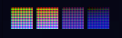
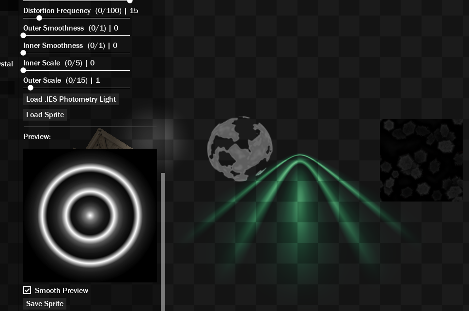
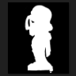
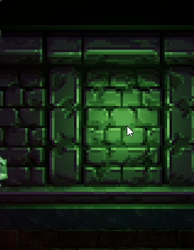

## Crystal Modules Functions List <!-- {docsify-ignore} -->

Below are listed all Modules Constructors and their methods available in Crystal.  
Although the topics are separate, they are all linked in some way.  

All these modules are optional and can be removed from the project without causing errors. But there is no reason to remove them, though, since they are just codes that weigh almost nothing. 

> Note: Most of the content here is also available offline using GameMaker's Feather. However, there is additional information here.

<br>


# Crystal_TimeCycle()

`Crystal_TimeCycle()` is responsible for controlling the ambient light and the intensity of the lights. It also has an internal clock, which can be adjusted. The clock supports hours, minutes and seconds.  

The day and night system works using LUTs as color palette. All types of LUT are supported: Strip, Quad and Hald. 



LUTs support hue, saturation, brightness, exposure, contrast, gamma, and more, allowing for full control of ambient light for aesthetic purposes.  

Check out [this tutorial](https://www.youtube.com/watch?v=-MLOn917H5o) on how to create LUTs.  

```gml
timeCycle = new Crystal_TimeCycle(lutSpritesArray, clockIsEnabled, clockSpeed, isCycling, [lutType], [lutHorizontalSquares], [animCurve], [ambientChannel], [lightChannel]);
```

| Name | Type | Description |  
|-----------|:-----------:|-----------:|  
| lutSpritesArray | Array | Array containing the LUT sprites. The order is from 00:00 until 23:59. You can add as many as you want. |  
| clockIsEnabled | Bool | Sets whether the clock is counting or not. The clock is just the time counter. |  
| clockSpeed | Real | Scalar speed of counting time. Usage (without quotes): "1/60": 24 hours time, "1": 24 minutes time, "60": 24 seconds time. |  
| isCycling | Bool | If true, a LUT surface will be generated and sent to the `Crystal_Renderer` (from `.Apply()`), and the ambient light and lights intensity will be adjusted according to the curve (overriding). |  
| lutType | Real | The LUT type to be used.  0: Strip, 1: Grid, 2: Hald Grid (Cube). |  
| lutHorizontalSquares | Real | Horizontal LUT squares. Example: 16 (Strip), 8 (Grid), 8 (Hald Grid). |  
| animCurve | Asset.GMAnimcurve | Animation curve that will be used to manipulate the LUT blending time and Lights Intensity. Ambient curve must range from 0 to 1, and lights should range from 0 to +; |  
| ambientChannel | Real | Ambient animation curve channel, used to define cycle progress between LUTs. Use 0 or the channel name. |  
| lightChannel | Real | Light animation curve channel, used to define lights intensity progress. Use 1 or the channel name. |  

<br>


## .Destroy()

Destroy time cycle (free from memory and stop execution). It is possible to call .Apply() again after calling this function.  

```gml
.Destroy();
```

<br>


## .Apply()

Apply Day Night Cycle to a renderer. Internally, this function will execute a Time Source to run the logic. This time source is responsible for running the clock and generating the LUT.  

```gml
.Apply([renderer]);
```

| Name | Type | Description |  
|-----------|:-----------:|-----------:|  
| renderer | Struct.Crystal_Renderer,Real | The renderer to add the TimeCycle for rendering. If not specified, adds to the last created renderer (or set with crystal_set_renderer()). Leave as `-1` if you don't want to send data to the renderer automatically (useful if you want to reuse the same Time Cycle system in more than one `Crystal_Renderer()`). Then you will use `.SendParameters()` in Step Event to send the same Time Cycle instance to more than one renderer. This does NOT apply if you are only using a single `Crystal_Renderer()`.   |  

<br>


## .SendParameters()

Sends ambient light and light intensity parameters to a renderer. Can be used in more than one renderer (for split-screen games, for example), using the same `Crystal_TimeCycle()`. This function should only be used if you have set "renderer" to -1 in `.Apply()`.

```gml
.SendParameters([renderer]);
```

| Name | Type | Description |  
|-----------|:-----------:|-----------:|  
| renderer | Struct.Crystal_Renderer | The renderer to send info to.  |  

<br>


## .SetClockEnable()

Sets whether the clock is counting or not. The clock is just the time counter.  

```gml
.SetClockEnable(enabled);
```

| Name | Type | Description |  
|-----------|:-----------:|-----------:|  
| enabled | Bool | If true, the clock will run. Use -1 to toggle. |  

<br>


## .SetCyclingEnable()

If true, a LUT surface will be generated and sent to the Crystal_Renderer (from .Apply()), and the intensity of the lights will be adjusted according to the curve (overriding).  

```gml
.SetCyclingEnable(enabled);
```

| Name | Type | Description |  
|-----------|:-----------:|-----------:|  
| enabled | Bool | If true, the clock will run. Use -1 to toggle. |  

<br>


## .SetLUTSprites()

Defines the array with LUT sprites, used to interpolate colors.  

```gml
.SetLUTSprites(lutSpritesArray);
```

| Name | Type | Description |  
|-----------|:-----------:|-----------:|  
| lutSpritesArray | Array | The array with LUT sprites. |  

<br>


## .SetTime()

Sets the Day & Night cycle time. It is possible to skip parameters, for example: change only the minutes: `.SetTime(, 30)`; This will leave the rest untouched.  

```gml
.SetTime([hours], [minutes], [seconds]);
```

| Name | Type | Description |  
|-----------|:-----------:|-----------:|  
| hours | Real | Hours amount. (0 - 24). |  
| minutes | Real | Minutes amount. (0 - 60). |  
| seconds | Real | Seconds amount. (0 - 60). |  

<br>


## .SetTimeNormalized()

Sets the Day & Night cycle time, but using a normalized value (from 0 to 1). Useful if you want to define the progress yourself, like for time seasons for example.  

Using this function causes the internal timer to be ignored.  

```gml
.SetTimeNormalized(time);
```

| Name | Type | Description |  
|-----------|:-----------:|-----------:|  
| time | Real | The normalized time (from 0 to 1). |  

<br>


## .SetDeltaTime()

Sets the delta time variable to be used in the clock (optional).  

```gml
.SetDeltaTime(deltaTime);
```

| Name | Type | Description |  
|-----------|:-----------:|-----------:|  
| deltaTime | Real | The delta time. 1 is the default delta time. |  

<br>


## .SetClockSpeed()

Set clock speed.  

```gml
.SetClockSpeed(clockSpeed);
```

| Name | Type | Description |  
|-----------|:-----------:|-----------:|  
| clockSpeed | Real | Scalar speed of counting time. Usage: `1/60`: 24 hours time, `1`: 24 minutes time, `60`: 24 seconds time. |  

<br>


## .GetSunAngle()

Returns the sun angle (from 0 to 360 degrees) with respect to time.  

```gml
.GetSunAngle() -> Real;
```

<br>


## .GetTime()

Returns the formatted time of day and night cycle.  

```gml
.GetTime() -> String;
```

<br>


## .GetTimeNormalized()

Returns time normalized to a value from 0 to 1.  

```gml
.GetTimeNormalized() -> Real;
```

<br>


## .GetHours()

Returns the hours of the day and night cycle.  

```gml
.GetHours() -> Real;
```

<br>


## .GetMinutes()

Returns the minutes of the day and night cycle.  

```gml
.GetMinutes() -> Real;
```

<br>


## .GetSeconds()

Returns the second of the day and night cycle.  

```gml
.GetSeconds() -> Real;
```

<br>


## .GetDays()

Returns the days of the day and night cycle.  

```gml
.GetDays() -> Real;
```

<br>


## .GetClockSpeed()

Returns the days of the day and night cycle.  

```gml
.GetClockSpeed() -> Real;
```

<br>


# Crystal_Cookie()

`Crystal_Cookie()` is used to generate a light cookie that can be used with spot lights. The cookie can be generated from a sprite, surface or IES file. If not in use, free it from memory using `.Destroy()`. Getting the sprite with `.GetSprite()` will do that automatically for you.  

The term "sample" here refers to a sprite or surface that will be rendered inside the internal cookie surface, which is used to generate the cookie using the generator shader or .IES file.

```gml
cookie = new Crystal_Cookie(width);
```

| Name | Type | Description |  
|-----------|:-----------:|-----------:|  
| width | Real | The size of the generated cookie image. Influence on quality. |  

<br>


## .Destroy()

Delete cookie from memory. The generated sprite with `.GetSprite()` will NOT be deleted! Only the internal surface. 

```gml
.Destroy();
```

<br>


## .FromIES()

Load a sample from an .IES photometry file loaded from a buffer.  

IES files describe how light from a lamp is distributed in a room. This data is provided by many manufacturers so that lighting designers can realistically simulate how a project will look when a specific light source is used. 

You can obtain numerous IES files for free on the internet, like in the website below, or generate your own.

https://ieslibrary.com/

Supported format: IESNA LM-63 (2019, 2002 and 1995). Which means it should work with most (or all?) IES files.



```gml
.FromIES(buffer, deleteBuffer);
```

| Name | Type | Description |  
|-----------|:-----------:|-----------:|  
| buffer | Id.Buffer | The buffer to load data from. You can use `buffer_load()` or `buffer_load_async()` - see GM manual. |  
| deleteBuffer | Bool | If true (default), it will delete the buffer immediately after loading the data. |  

Example:

```gml
cookie = new Crystal_Cookie().FromIES(buffer_load("CarHeadlight.ies")).GetSprite();
cookieTexture = sprite_get_texture(cookie, 0);
```

<br>


## .FromSurface()

Apply Day Night Cycle to a renderer. Internally, this function will execute a Time Source to run the logic. This time source is responsible for running the clock and generating the LUT.  

```gml
.FromSurface(surface);
```

| Name | Type | Description |  
|-----------|:-----------:|-----------:|  
| surface | Id.Surface | The surface to generate cookie from. |  

<br>


## .FromSprite()

Load a sample from a sprite.  

```gml
.FromSprite(sprite);
```

| Name | Type | Description |  
|-----------|:-----------:|-----------:|  
| sprite | Asset.GMSprite | The sprite to generate cookie from. |  

<br>


# Crystal_LightData()

`Crystal_LightData()` is a class responsible for saving and loading all lights (dynamic and static), including their positions, depth and other parameters. Useful for editing lights in-game and then loading. 

While possible, I generally don't recommend using this in production, due to the fact that it's easier to lose information and textures are not stored here. 

```gml
lightData = new Crystal_LightData(destroyBeforeLoading);
```

| Name | Type | Description |  
|-----------|:-----------:|-----------:|  
| destroyBeforeLoading | Bool | If true, all lights will be destroyed before loading new lights. Default is `false`. |  

<br>


## .SaveBuffer()

Save JSON light data to a file. 

```gml
.SaveBuffer(path, description);
```

| Name | Type | Description |  
|-----------|:-----------:|-----------:|  
| path | String | File path to save. |  
| description | String | File description. |  

<br>


## .LoadBuffer()

Load light data from JSON buffer file. This will parse and all lights will be created, including it's parameters. 

> IMPORTANT: The loaded buffer is NOT deleted automatically. This function only reads the buffer. To prevent memory leak, consider deleting the loaded buffer later.

```gml
.LoadBuffer(buffer);
```

| Name | Type | Description |  
|-----------|:-----------:|-----------:|  
| buffer | Id.Buffer | The buffer with JSON data containing all light data. You could use `buffer_load()` or `buffer_load_async()`. |  

<br>


# Crystal_AlphaBaker()

`Crystal_AlphaBaker()` aims to add an alpha channel to materials, including normal maps, based on the alpha channel of the albedo, or of a specific sprite for mask (black and white).  

This is useful for pre-calculating the alpha channel before using the material sprites in the game, reducing overdraw and dramatically increasing performance.  

This is optional, you can also draw the materials **already with alpha channel**. This can be more useful if you export animations from Blender without alpha channel, for example.

```gml
alphaBaker = new Crystal_AlphaBaker();
```

<br>


## .SetInputFolder()

Define the folder to search for image files.

```gml
.SetInputFolder(folderPath);
```

| Name | Type | Description |  
|-----------|:-----------:|-----------:|  
| folderPath | String | The folder path to search for files. |  

<br>


## .SetOutputFolder()

Define the folder to search for image files.

```gml
.SetOutputFolder(folderPath);
```

| Name | Type | Description |  
|-----------|:-----------:|-----------:|  
| folderPath | String | The folder path to save generated image files. |  

<br>


## .Bake()

Search for files (*in the input folder*), bake alpha into them and export them to the *output* folder.

This function will search for files that have the codenames (upper or lower case - it doesn't matter):  
* "**mask**" (Black & White mask)  
* "**albedo**" (Default sprite with alpha)  
* "**normal/normals/nml**" (NormalMap)  
* "**metallic**"  
* "**roughness/specular**"  
* "**ao**" (Ambient Occlusion)  

The mask should look like this:



**IMPORTANT:**  

The INPUT folder **MUST contain several other folders containing all respective material sprites**.  
Example:
* `InputFolder/Sprite1/albedo.png, normal.png`
* `InputFolder/Sprite2/albedo.png, normal.png, metallic.png ...`

The file names don't matter, the script just needs to detect the words "normal", "ao", etc. Writing the name "albedo" is optional. 

Note that when having "albedo" and "mask" sprites in the same folder, the "mask" sprite takes priority.  

If there is an "albedo" sprite in the folder, the alpha channel of that sprite will be used as the alpha channel for the materials.  

If there is a "mask" sprite in the folder, the "albedo" is ignored and black colors will clip the alpha channel and white colors will keep the pixels opaque.  

Animated sprites MUST be in strip format (horizontal sequence). .gif images only support the first frame (GM limitation).  

```gml
.Bake();
```

Example:

```gml
alphaBaker = new Crystal_AlphaBaker();
alphaBaker.SetInputFolder("D:/GmImages/ToConvert/");
alphaBaker.SetOutputFolder("D:/GmImages/Exported/");
alphaBaker.Bake();
```

This will search for  files, add the alpha and export them.

<br>


# Layer Effects

When using `Crystal_MaterialLayer()`, you can apply custom effects to the layer, such as a normal map generator. You can also create your own effects. 

<br>


## .Crystal_LayerFXNormalFromLuminance()

Effect for a Material Layer. Generates normal maps on an entire layer, based on the luminance of the sprites.  



> NOTE: Normal maps drawn manually or generated by other appropriate software will ALWAYS look better. Recommended to use this for tilesets and such, or even for testing, since there is GPU usage to render the normals.  

```gml
effect = new Crystal_LayerFXNormalFromLuminance();
```

**Public Variables**

| Name | Type | Description |  
|-----------|:-----------:|-----------:|  
| angle | Real | Normals angle. |  
| xScale | Real | The x scale. |  
| yScale | Real | The y scale. |  
| offsetX | Real | The x offset. |  
| offsetY | Real | The y offset. |  
| strengthX | Real | The x strength. |  
| strengthY | Real | The y strength. |  
| thresholdMin | Real | Filter luminance, minimum value. |  
| thresholdMax | Real | Filter luminance, maximum value. |  
| blurAmount | Real | Amount of blur. Only available with mip maps (experimental). |  
| outlineRadius | Real | If > 0, the normal map will be generated inside an outline. This sets the thickness of the outline in pixels. |  

<br>


# Crystal_DebugUI()

`Crystal_DebugUI()` is used to monitor, inspect, edit in-game lights and other cool features. Use .Draw() in Post-Draw (recommended) or Draw GUI to visualize the UI.

> It is recommended to create the debug UI using `crystal_debug_show()`, since with this constructor, you need to call `.Draw()` to draw the UI, and the function already creates an object that does this for you.

```gml
debug = new Crystal_DebugUI(origin, classInstance, isOpened, startMaximized);
```

| Name | Type | Description |  
|-----------|:-----------:|-----------:|  
| origin | Id.Instance | The origin instance to find Crystal constructors to inspect. |  
| classInstance | Struct | The system struct returned from a constructor/class. Let it blank/undefined if you want the Debug UI to search it for you, in the current object/context. |  
| isOpened | Bool | If true, the UI starts opened. |  
| startMaximized | Bool | Windows will appear maximized. |  

<br>
