## Crystal Lights Types <!-- {docsify-ignore} -->

Below are listed all the light types supported by Crystal. 

Important: Changing the `litType` and `shadowLitType` of lights can cause confusing behavior, so only use this *if you really know what you are doing*. The default value for both is `LIT_LESS_EQUAL`. 

These lights also work with pixel-art. Their resolution is naturally affected by the resolution of the `application_surface` (or Crystal's input surface). 

Note that by default, lights only cast **vertex shadows**. To cast **sprite shadows**, you must change the shadow shader using the `shadowShaderType` variable. You can choose to cast both or individually, through the `LIGHT_SHADOW_SHADER_*` macro

 

# Global Light

The global light is defined by the ambient light. This ambient light is defined in the `Crystal_Renderer` itself.

See: [Crystal_Renderer().SetAmbientColor()](./pages/scripting/functions_list_core?id=setambientcolor);

| Natural Ambient Light | Lights On During the Day |  
|---|---|  
|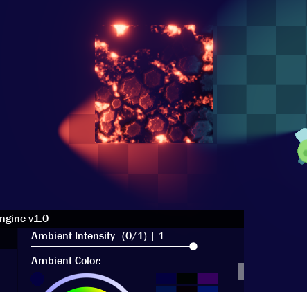 | 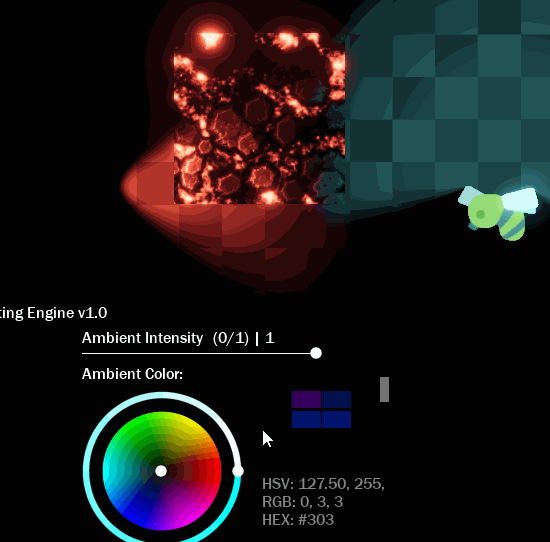   |  

 

# Point Light

Point light is a type of omnidirectional light. With it, you can generate a highly customizable circular light. 

| Highly customizable | Change `levels` too (great for pixel-art) |  
|---|---|  
|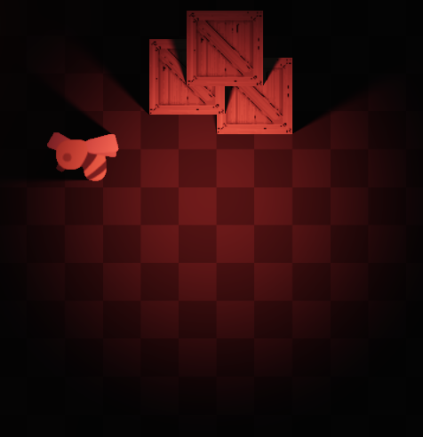 | 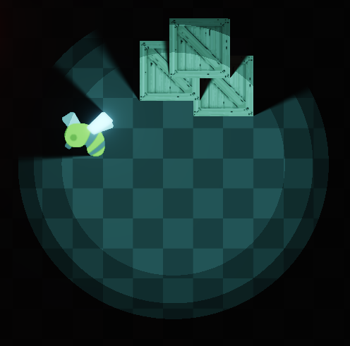   |  

**Properties:**

| Name | Type | Description | Basic | Phong | BRDF |  
|------|------|-------------|-------|-------|------|  
| enabled | Bool | Activate or deactivate light without destroying it. | ✔️ | ✔️ | ✔️  
| depth | Real | The light depth (layers are supported). | ✔️ | ✔️ | ✔️  
| shaderType | Macro | The light shader type. | ✔️ | ✔️ | ✔️  
| color | Color | The light color. | ✔️ | ✔️ | ✔️  
| intensity | Real | The light Intensity. | ✔️ | ✔️ | ✔️  
| inner | Real | The light inner. (0 - 1). | ✔️ | ✔️ | ✔️  
| falloff | Real | The light falloff. (0 - 1, 0.5 = middle/default) | ✔️ | ✔️ | ✔️  
| radius | Real | The light radius. | ✔️ | ✔️ | ✔️  
| levels | Real | The light levels. (1-65536 or 256). | ✔️ | ✔️ | ✔️  
| castShadows | Bool | Toggle shadow casting. | ✔️ | ✔️ | ✔️  
| selfShadows | Bool | Toggle self shadows. | ✔️ | ✔️ | ✔️  
| penetration | Real | Shadow light penetration. | ✔️ | ✔️ | ✔️  
| shadowPenumbra | Real | Shadow penumbra. (0 - 100). | ✔️ | ✔️ | ✔️  
| shadowUmbra | Real | Shadow umbra. (0 - 1). | ✔️ | ✔️ | ✔️  
| shadowAlpha | Real | Shadow alpha/opacity. (0 - 1, 1 = 100% blocked light). | ✔️ | ✔️ | ✔️  
| shadowScattering | Real | Additional value to `shadowLength` of shadows. (0 = not affected). | ✔️ | ✔️ | ✔️  
| shadowDepthOffset | Real | Additional value to `depth` of shadows. (0 = not affected). | ✔️ | ✔️ | ✔️  
| normalDistance | Real | Normal map distance from ground (z). | ❌ | ✔️ | ✔️  
| diffuse | Real | Control only the light diffuse intensity. (1 = default). | ✔️ | ✔️ | ✔️  
| specular | Real | Control only the light specular intensity. (0 = none). | ❌ | ✔️ | ✔️  
| reflection | Real | The light reflection offset. (0 = none. Default is 0.25). | ❌ | ❌ | ✔️  
| litType | Macro | Influences how light behaves in relation to depth. | ✔️ | ✔️ | ✔️  
| shadowLitType | Macro | Influences how light shadow behaves in relation to depth. | ✔️ | ✔️ | ✔️  

 

# Spot Light

The spot light projects light in one direction. This light is very customizable and dynamic and can even project images (light cookie). It is also possible to create wide ceiling lights. 

| Highly customizable | Highly customizable |  
|---|---|  
|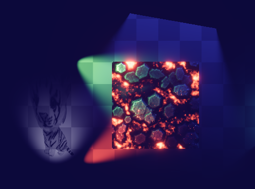 | 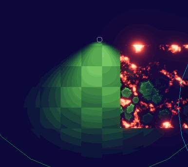   |  

**Properties:**

| Name | Type | Description | Basic | Phong | BRDF |  
|------|------|-------------|-------|-------|------|  
| enabled | Bool | Activate or deactivate light without destroying it. | ✔️ | ✔️ | ✔️  
| depth | Real | The light depth (layers are supported). | ✔️ | ✔️ | ✔️  
| shaderType | Macro | The light shader type. | ✔️ | ✔️ | ✔️  
| color | Color | The light color. | ✔️ | ✔️ | ✔️  
| intensity | Real | The light Intensity. | ✔️ | ✔️ | ✔️  
| inner | Real | The light inner. 0 - 1. | ✔️ | ✔️ | ✔️  
| falloff | Real | The light falloff. (0 - 1, 0.5 = middle/default) | ✔️ | ✔️ | ✔️  
| radius | Real | The light radius. | ✔️ | ✔️ | ✔️  
| levels | Real | The light levels. (1-65536 or 256). | ✔️ | ✔️ | ✔️  
| angle | Real | The light angle. (0-360). | ✔️ | ✔️ | ✔️  
| width | Real | The light width (useful for line lights too). (0 = none). | ✔️ | ✔️ | ✔️  
| spotFOV | Real | Spot field of view (0-180). Recommended 90 if you want to tilt the light. | ✔️ | ✔️ | ✔️  
| spotSmoothness | Real | The spot edges smoothness. | ✔️ | ✔️ | ✔️  
| spotDistance | Real | The spot distance from ground. (0 = on ground). The ground limit is the `depth`. | ✔️ | ✔️ | ✔️  
| tilt | Real | The spot tilt. (0 = no tilt. 1 = full tilted). | ✔️ | ✔️ | ✔️  
| cookieTexture | Pointer.Texture | The cookie (image projection) texture. Use `sprite_get_texture` or `surface_get_texture` | ❌ | ✔️ | ✔️  
| castShadows | Bool | Toggle shadow casting. | ✔️ | ✔️ | ✔️  
| selfShadows | Bool | Toggle self shadows. | ✔️ | ✔️ | ✔️  
| penetration | Real | Shadow light penetration. | ✔️ | ✔️ | ✔️  
| shadowPenumbra | Real | Shadow penumbra. (0 - 100). | ✔️ | ✔️ | ✔️  
| shadowUmbra | Real | Shadow umbra. (0 - 1). | ✔️ | ✔️ | ✔️  
| shadowAlpha | Real | Shadow alpha/opacity. (0 - 1, 1 = 100% blocked light). | ✔️ | ✔️ | ✔️  
| shadowScattering | Real | Additional value to `shadowLength` of shadows. (0 = not affected). | ✔️ | ✔️ | ✔️  
| shadowDepthOffset | Real | Additional value to `depth` of shadows. (0 = not affected). | ✔️ | ✔️ | ✔️  
| normalDistance | Real | Normal map distance from ground (z). | ❌ | ✔️ | ✔️  
| diffuse | Real | Control only the light diffuse intensity. (1 = default). | ✔️ | ✔️ | ✔️  
| specular | Real | Control only the light specular intensity. (0 = none). | ❌ | ✔️ | ✔️  
| reflection | Real | The light reflection offset. (0 = none. Default is 0.25). | ❌ | ❌ | ✔️  
| litType | Macro | Influences how light behaves in relation to depth. | ✔️ | ✔️ | ✔️  
| shadowLitType | Macro | Influences how light shadow behaves in relation to depth. | ✔️ | ✔️ | ✔️  

If you use `tilt` at `0`, you need to increase the `spotDistance` value, so that you can see the cone of light pointing at the ground.  

If you want the spot light to look like a point light: While at `tilt = 0` (no tilt), to have the same size as the `radius`, you should set `spotDistance` equal to the `radius`, while `spotFOV` is equal to 90. 

You can generate cookies with your own sprites/textures or use `Crystal_Cookie()` to generate cookies (including .IES files). The cookie sprite works best as a square image, like the ones below: 

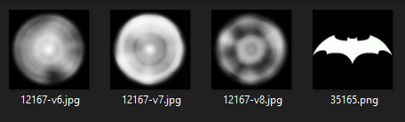

The sprite can be colored and have transparency as well (RGBA is supported).

 

# Sprite Light

The sprite light allows you to define a sprite as a light. This allows you to create lights of custom shapes. 

Note that because it is a sprite, it does not *necessarily* need to be grayscale/single color. The sprite can also have transparency (or a black opaque background).  

| Any kind of sprite | Several possibilities |  
|---|---|  
|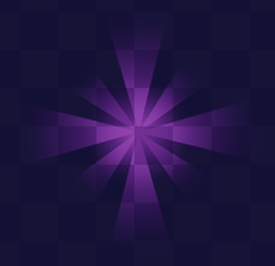 | 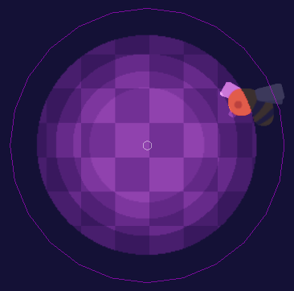   |  

**Properties:**

| Name | Type | Description | Basic | Phong | BRDF |  
|------|------|-------------|-------|-------|------|  
| enabled | Bool | Activate or deactivate light without destroying it. | ✔️ | ✔️ | ✔️  
| depth | Real | The light depth (layers are supported). | ✔️ | ✔️ | ✔️  
| shaderType | Macro | The light shader type. | ✔️ | ✔️ | ✔️  
| sprite_index | Asset.GMSprite | The light sprite. | ✔️ | ✔️ | ✔️  
| image_index | Real | The light sprite index. | ✔️ | ✔️ | ✔️  
| image_xscale | Real | The light sprite xscale. | ✔️ | ✔️ | ✔️  
| image_yscale | Real | The light sprite yscale. | ✔️ | ✔️ | ✔️  
| image_angle | Real | The light sprite angle. | ✔️ | ✔️ | ✔️  
| image_blend | Real | The light sprite color. | ✔️ | ✔️ | ✔️  
| image_alpha | Real | The light sprite alpha. | ✔️ | ✔️ | ✔️  
| intensity | Real | The light Intensity. | ✔️ | ✔️ | ✔️  
| castShadows | Bool | Toggle shadow casting. | ✔️ | ✔️ | ✔️  
| selfShadows | Bool | Toggle self shadows. | ✔️ | ✔️ | ✔️  
| penetration | Real | Shadow light penetration. | ✔️ | ✔️ | ✔️  
| shadowPenumbra | Real | Shadow penumbra. (0 - 100). | ✔️ | ✔️ | ✔️  
| shadowUmbra | Real | Shadow umbra. (0 - 1). | ✔️ | ✔️ | ✔️  
| shadowAlpha | Real | Shadow alpha/opacity. (0 - 1, 1 = 100% blocked light). | ✔️ | ✔️ | ✔️  
| shadowScattering | Real | Additional value to `shadowLength` of shadows. (0 = not affected). | ✔️ | ✔️ | ✔️  
| shadowDepthOffset | Real | Additional value to `depth` of shadows. (0 = not affected). | ✔️ | ✔️ | ✔️  
| normalDistance | Real | Normal map distance from ground (z). | ❌ | ✔️ | ✔️  
| diffuse | Real | Control only the light diffuse intensity. (1 = default). | ✔️ | ✔️ | ✔️  
| specular | Real | Control only the light specular intensity. (0 = none). | ❌ | ✔️ | ✔️  
| reflection | Real | The light reflection offset. (0 = none. Default is 0.25). | ❌ | ❌ | ✔️  
| litType | Macro | Influences how light behaves in relation to depth. | ✔️ | ✔️ | ✔️  
| shadowLitType | Macro | Influences how light shadow behaves in relation to depth. | ✔️ | ✔️ | ✔️  

 

# Shape Light

A shape light allows you to create lights from points. You can use a path to create the shape of the light. 

The light is a vertex buffer, and vertex generation is automatically optimized depending on the parameters. If radius is 0, edge vertices are not generated. The vertex buffer is generated only once, or when you modify generative variables such as `path`, `radius`, `color` and `cornerPrecision`.

The generation of vertices in each corner is dynamic, depending on the opening angle. 

| Useful for scenery, godrays and others | Very customizable |  
|---|---|  
|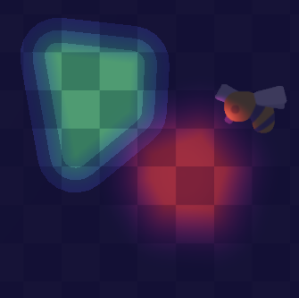 | 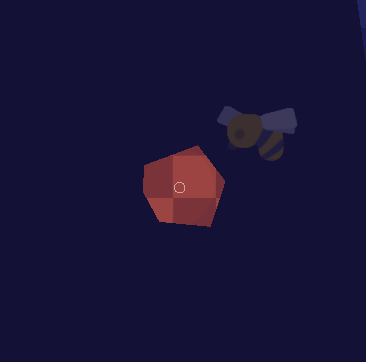   |  

**Properties:**

| Name | Type | Description | Basic | Phong | BRDF |  
|------|------|-------------|-------|-------|------|  
| enabled | Bool | Activate or deactivate light without destroying it. | ✔️ | ✔️ | ✔️  
| depth | Real | The light depth (layers are supported). | ✔️ | ✔️ | ✔️  
| path | Asset.GMPath | The path with points to generate light from. Only straight path is supported. | ✔️ | ✔️ | ✔️  
| cornerPrecision | Real | Maximum number of vertices generated in each corner. (Generally, 10 is enough). | ✔️ | ✔️ | ✔️  
| shaderType | Macro | The light shader type. | ✔️ | ✔️ | ✔️  
| color | Color | The light color. | ✔️ | ✔️ | ✔️  
| colorOuter | Color | The light outer (edge) color. | ✔️ | ✔️ | ✔️  
| intensity | Real | The light Intensity. | ✔️ | ✔️ | ✔️  
| inner | Real | The light inner. 0 - 1. | ✔️ | ✔️ | ✔️  
| falloff | Real | The light falloff. (0 - 1, 0.5 = middle/default) | ✔️ | ✔️ | ✔️  
| radius | Real | The light edge radius. (0 = no edges). | ✔️ | ✔️ | ✔️  
| levels | Real | The light levels. (1-65536 or 256). | ✔️ | ✔️ | ✔️  
| castShadows | Bool | Toggle shadow casting. | ✔️ | ✔️ | ✔️  
| selfShadows | Bool | Toggle self shadows. | ✔️ | ✔️ | ✔️  
| penetration | Real | Shadow light penetration. | ✔️ | ✔️ | ✔️  
| shadowPenumbra | Real | Shadow penumbra. (0 - 100). | ✔️ | ✔️ | ✔️  
| shadowUmbra | Real | Shadow umbra. (0 - 1). | ✔️ | ✔️ | ✔️  
| shadowAlpha | Real | Shadow alpha/opacity. (0 - 1, 1 = 100% blocked light). | ✔️ | ✔️ | ✔️  
| shadowScattering | Real | Additional value to `shadowLength` of shadows. (0 = not affected). | ✔️ | ✔️ | ✔️  
| shadowDepthOffset | Real | Additional value to `depth` of shadows. (0 = not affected). | ✔️ | ✔️ | ✔️  
| normalDistance | Real | Normal map distance from ground (z). | ❌ | ✔️ | ✔️  
| diffuse | Real | Control only the light diffuse intensity. (1 = default). | ✔️ | ✔️ | ✔️  
| specular | Real | Control only the light specular intensity. (0 = none). | ❌ | ✔️ | ✔️  
| reflection | Real | The light reflection offset. (0 = none. Default is 0.25). | ❌ | ❌ | ✔️  
| litType | Macro | Influences how light behaves in relation to depth. | ✔️ | ✔️ | ✔️  
| shadowLitType | Macro | Influences how light shadow behaves in relation to depth. | ✔️ | ✔️ | ✔️  

 

# Direct Light

Directional (direct) light is useful for simulating sunlight (even with shadows), directional aesthetic lights or illuminating layers. 

This type of light is super fast. 

| Directional Light with shadows | Very customizable |  
|---|---|  
|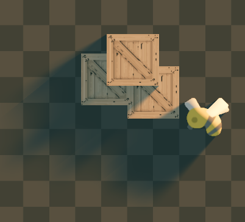 | 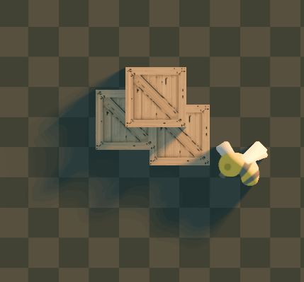   |  

**Properties:**

| Name | Type | Description | Basic | Phong | BRDF |  
|------|------|-------------|-------|-------|------|  
| enabled | Bool | Activate or deactivate light without destroying it. | ✔️ | ✔️ | ✔️  
| depth | Real | The light depth (layers are supported). | ✔️ | ✔️ | ✔️  
| shaderType | Macro | The light shader type. | ✔️ | ✔️ | ✔️  
| color | Color | The light color. | ✔️ | ✔️ | ✔️  
| intensity | Real | The light Intensity. | ✔️ | ✔️ | ✔️  
| angle | Real | The directional light angle. (0-360). | ✔️ | ✔️ | ✔️  
| inner | Real | The light inner. 0 - 1. | ✔️ | ✔️ | ✔️  
| falloff | Real | The light falloff. (0 - 1, 0.5 = middle/default) | ✔️ | ✔️ | ✔️  
| radius | Real | The light radius. | ✔️ | ✔️ | ✔️  
| levels | Real | The light levels. (1-65536 or 256). | ✔️ | ✔️ | ✔️  
| castShadows | Bool | Toggle shadow casting. | ✔️ | ✔️ | ✔️  
| selfShadows | Bool | Toggle self shadows. | ✔️ | ✔️ | ✔️  
| penetration | Real | Shadow light penetration. | ✔️ | ✔️ | ✔️  
| shadowPenumbra | Real | Shadow penumbra. (0 - 100). | ✔️ | ✔️ | ✔️  
| shadowUmbra | Real | Shadow umbra. (0 - 1). | ✔️ | ✔️ | ✔️  
| shadowAlpha | Real | Shadow alpha/opacity. (0 - 1, 1 = 100% blocked light). | ✔️ | ✔️ | ✔️  
| shadowScattering | Real | Additional value to `shadowLength` of shadows. (0 = not affected). | ✔️ | ✔️ | ✔️  
| shadowDepthOffset | Real | Additional value to `depth` of shadows. (0 = not affected). | ✔️ | ✔️ | ✔️  
| normalDistance | Real | Normal map distance from ground (z). | ❌ | ✔️ | ✔️  
| diffuse | Real | Control only the light diffuse intensity. (1 = default). | ✔️ | ✔️ | ✔️  
| specular | Real | Control only the light specular intensity. (0 = none). | ❌ | ✔️ | ✔️  
| reflection | Real | The light reflection offset. (0 = none. Default is 0.25). | ❌ | ❌ | ✔️  
| litType | Macro | Influences how light behaves in relation to depth. | ✔️ | ✔️ | ✔️  
| shadowLitType | Macro | Influences how light shadow behaves in relation to depth. | ✔️ | ✔️ | ✔️  

# Basic Light

Basic Lights are ultra efficient. If you want to have lots of lights rendering at the same time (like 10.000).

This type of light:
- Does not support shadows. If you want it, use a "Sprite Light" instead. This is because fewer calculations are made.  
- Allows you to draw whatever you want in the Draw Event, so it's a reward for not having shadows.  
- Does not cause Texture Swaps or Batch Breaks (if using `draw_self()`, for example), which is good for performance.  

| Any kind of sprite | Still very customizable |  
|---|---|  
|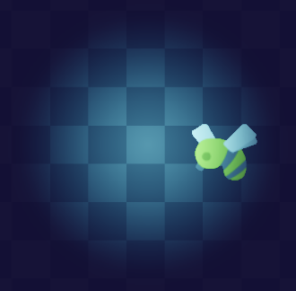 | 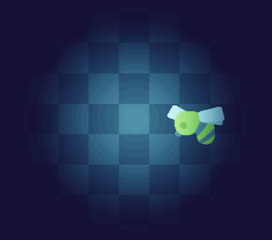   |  

**Properties:**

| Name | Type | Description
|------|------|------------|
| enabled | Bool | Activate or deactivate light without destroying it. | 
| depth | Real | The light depth (layers are supported). | 
| intensity | Real | The light Intensity. | 
| sprite_index | Asset.GMSprite | The light sprite. | 
| image_index | Real | The light sprite index. | 
| image_xscale | Real | The light sprite xscale. | 
| image_yscale | Real | The light sprite yscale. | 
| image_angle | Real | The light sprite angle. | 
| image_blend | Real | The light sprite color. | 
| image_alpha | Real | The light sprite alpha. | 

 
