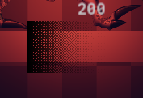
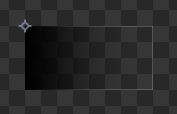

## Utils Functions List <!-- {docsify-ignore} -->

These functions can be used in some situations.  


## deferred_alpha_begin()

Since deferred rendering is notorious for issues with opacity, this should help in some cases where you need to have things with a lot of transparency and WITH depth buffer enabled. The shader discards fragments based on opacity, using dithering.  

It is recommended to only use this on sprites/things that have opacity and you want to achieve the effect, as discarding pixels is not very light, especially on Android. You don't need to worry about this with desktop platforms. 

This will affect any following graphics until you call `deferred_alpha_end()`.

There are more examples of using this function in [Troubleshooting](./pages/tutorials/troubleshooting.md).

```gml
deferred_alpha_begin(threshold, bayerSprite, bayerSize);
```

| Name | Type | Description |  
|-----------|:-----------:|-----------:|  
| threshold | Real | The threshold to start dithering (0 - 1). Default is 0 (full alpha). |  
| bayerSprite | Asset.GMSprite | The matrix sprite to be used for dithering. |  
| bayerSize | Real | The bayer matrix sprite size. |  

Example:

```gml
deferred_alpha_begin(0);
draw_sprite(sprGradient, 0, mouse_x, mouse_y);
deferred_alpha_end();
```

In-Game:


Sprite:


<br>


## deferred_alpha_end()

Ends the deferred alpha shader.  

```gml
deferred_alpha_end();
```

<br><br>


## mat_emission_begin()

Defines the emission shader. 

```gml
mat_emission_begin(intensity);
```

| Name | Type | Description |  
|-----------|:-----------:|-----------:|  
| intensity | Real | The emission intensity. |  

Example:

```gml
mat_emission_begin(1.8);
draw_sprite(sprGradient, 0, mouse_x, mouse_y);
mat_emission_end();
```

<br>


## mat_emission_set_intensity()

Defines the emission intensity. Must be used after `mat_emission_begin()`.

```gml
mat_emission_set_intensity();
```

<br>


## mat_emission_end()

Ends the emission shader.

```gml
mat_emission_end();
```

<br><br>


## mat_normal_begin()

Defines the normal shader. 

```gml
mat_normal_begin(angle, scaleX, scaleY);
```

| Name | Type | Description |  
|-----------|:-----------:|-----------:|  
| angle | Real | The normal angle. |  
| scaleX | Real | The normal x scale. |  
| scaleY | Real | The normal y scale. |  

Example:

```gml
mat_normal_begin(1.8);
draw_sprite(sprGradient, 0, mouse_x, mouse_y);
mat_emission_end();
```

<br>


## mat_normal_set_angle()

Defines the normal angle. Must be used after `mat_normal_begin()`. 

```gml
mat_normal_set_angle(angle);
```

<br>


## mat_normal_set_scale()

Defines the normal scale. Must be used after `mat_normal_begin()`. 

```gml
mat_normal_set_scale(scaleX, scaleY);
```

| Name | Type | Description |  
|-----------|:-----------:|-----------:|  
| scaleX | Real | The normal x scale. |  
| scaleY | Real | The normal y scale. |  

<br>


## mat_normal_end()

Ends the normal shader. 

```gml
mat_normal_end();
```

<br><br>


