## Introduction <!-- {docsify-ignore} -->

In this tutorial, you will understand what a material is, how they work and how to use them in the game, and even what the workflow is for creating assets/sprites to be used as a material.

More info: [Crystal_Material()](./pages/scripting/functions_list_core?id=crystal_material)

> By default, Renderer materials are disabled, so before using materials, you need to enable them in the renderer using [.SetMaterialsEnable()](./pages/scripting/functions_list_core?id=setmaterialsenable).

If you are unfamiliar with some terms, try looking in other sources, as the Crystal workflow is similar (like Blender) and the focus here is only on the essentials and how to make it work.  

</br>


## What is a Material

A material refers to the properties of an object's surface. Basically, a sprite without materials is what it looks like, but if you add normal maps for example, it can look like a dynamic 3D sprite.  

This is optional, you will only need materials if you want to achieve the following PBR effects:  
Normal Map, Emissive, Unlit, Metallic, Roughness, Ambient Occlusion, Reflections and Light Mask.  

The purpose of the material is to be able to have additional effects to add more realism to the game, or even obtain aesthetic and futuristic effects with emissive sprites.  

You can achieve the same result as the image below with these features.

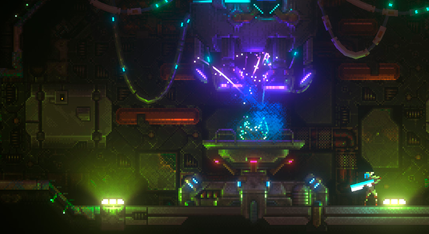
*MegaSphere game, by AKGames. Image used as demonstration only.*


</br>


## How to use it

Simply create a `Crystal_Material`, define the variables you want to use in the material, and use `.Apply()` to get the material working.

Example:
```gml
material = new Crystal_Material(id);
material.normalSprite = sprite_index;
material.normalSpriteSubimg = 1;
material.emissiveSprite = sprite_index;
material.emissiveSpriteSubimg = 2;
material.emission = 2;
material.metallicSprite = sprite_index;
material.metallicSpriteSubimg = 7;
material.roughnessSprite = sprite_index;
material.roughnessSpriteSubimg = 6;
material.aoSprite = sprite_index;
material.aoSpriteSubimg = 5;
material.Apply();
```
The cool part is that *you don't have to add all of this*! If you want to only add a emissive sprite, for example, just write `emissiveSprite`. You can use code completion to see the available variables.

Materials can be moved, rotated and scaled:
```gml
material.x = x;
material.y = y;
material.angle = image_angle;
material.xScale = image_xscale;
material.yScale = image_yscale;
```

They basically need to be a visual representation of the object, as the aim is for them to add realism to the object.

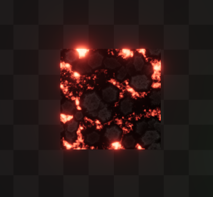

Sprites:
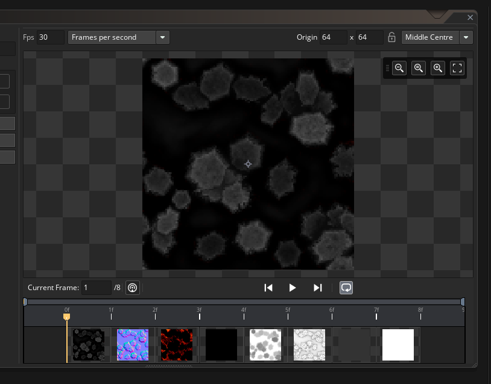


### Using with Spine

You can also use sprites created with Spine, just set `isBitmap` to `false` when creating the `Crystal_Material()`.


</br></br>


## Using Material Layers

We will often have cases where there are MANY sprites that need materials, such as normal maps, such as in scenarios. In these cases, using `Crystal_MaterialLayer` is more efficient and recommended. Material layers work for both moving and static sprites. And they work for any type of layer.

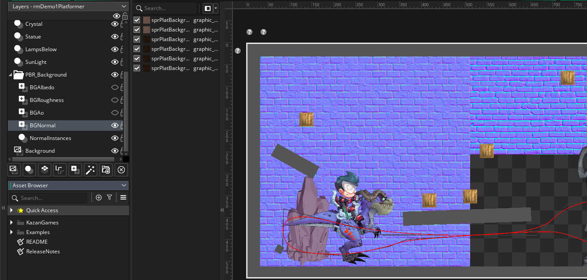


Material layers can be created like this (example):

```gml
// Normal map
bricksMatNormals = new Crystal_MaterialLayer(layer_get_depth("BGAlbedo")-1, CRYSTAL_PASS.NORMALS);
bricksMatNormals.AddLayers(layer_get_id("NormalsA"), layer_get_id("NormalsB")); // range 1
bricksMatNormals.AddLayers(layer_get_id("NormalsG"), layer_get_id("NormalsK")); // range 2 (still using the same internal surface)
bricksMatNormals.Apply();

// Metallic, Roughness, Ao and Mask
bricksMatPBR = new Crystal_MaterialLayer(layer_get_depth("BGAlbedo")-1, CRYSTAL_PASS.MATERIAL);
bricksMatPBR.AddLayers(layer_get_id("BGRoughness"),, CRYSTAL_MATERIAL.ROUGHNESS); // roughness range
bricksMatPBR.AddLayers(layer_get_id("BGAo"),, CRYSTAL_MATERIAL.AO); // ambient occlusion range
bricksMatPBR.Apply();
```
Note that for each `CRYSTAL_PASS`, you need to create a different `Crystal_MaterialLayer`. Note that the normal map (`NORMALS`) pass is different from the PBR material pass (`MATERIAL`), so we created two above.

A **range of layers** is defined by the set of layers that will be rendered within the material. It starts on the *top layer* and ends on the *bottom layer*. Don't add the bottom layer if you want **just a single layer**.

You can add **infinite ranges**, but note that they will all be rendered **at the same depth** of the `Crystal_MaterialLayer()`, since they are within the same surface.

This means that if you need to change the drawing depth from one range to another, you need to create another `Crystal_MaterialLayer()`.

> Don't forget to use .Apply(), otherwise the material layer will not be created!

More info: [Crystal_MaterialLayer()](./pages/scripting/functions_list_core?id=crystal_materiallayer)


### Using effects with material layers

It is possible to use effects on material layers, such as a **normal map generator**. To do this, simply create the effect and when creating the `Crystal_MaterialLayer()`, define it in the parameter.

```gml
// create effect
normalsEffect = new Crystal_LayerFXNormalFromLuminance();
normalsEffect.angle = 0;
normalsEffect.strengthX = 1;
normalsEffect.strengthY = 1;

// create material layer and send effect to it
bricksMatNormals = new Crystal_MaterialLayer(..., normalsEffect, true);
```

For the normal map generator, it may be interesting to activate layer drawing, so we set it to true.

</br></br>


## Creating assets

The most important thing when creating materials is: If your albedo sprite **has alpha**, your Material sprites (like normal map) must have alpha too, otherwise the normal map will not be able to **overlap** with other sprites correctly, as expected (because it is opaque).


This is valid for everything: normal maps, metallic, roughness, ao, emissive, reflections, etc.

> Tip: Crystal has a tool to bake albedo alpha in other material sprites that do not have alpha: `Crystal_AlphaBaker()`.

If you don't want the normal map to overlap with others, paint the normal map sprite with the default normal map color (**purple**: RGB: 128, 128, 255).  


If you want the light to not reach certain areas of the sprite, you can paint some areas of the normal map to **black**, blocking the light. Useful for creating [this kind of effect](https://www.reddit.com/r/gamedev/comments/e71mao/edge_lighting_for_pixel_art/?rdt=64447):

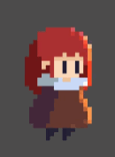


### Normal Map

The normal represents the direction of the surface, which will be used to indicate the direction in which the light will reflect off the object.  

To create normal map sprites, there are various softwares and tutorials on YouTube, you basically just need to create sprites where each color channel represents the direction in which the light reflects.

Red: horizontal (>>)  
green: vertical (^^)  
blue: center (xx)  

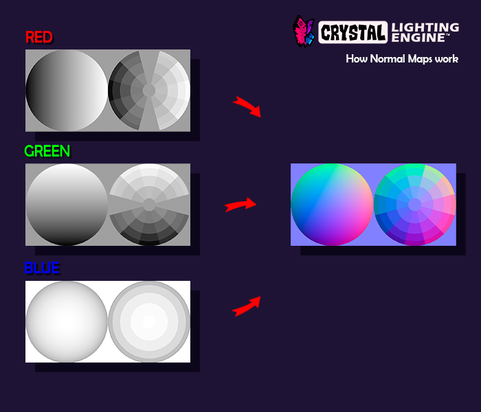

Albedo (default):  


Normals:  
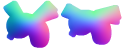

In-game:  
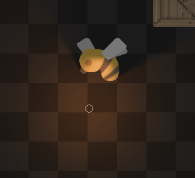

Softwares:
- Blender
- Sprite Light
- Sprite D Light
- ModLab
- ShaderMap
- Photoshop, Aseprite / Any image editor

Aseprite has a color wheel specifically designed for creating normal maps:

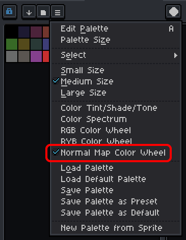

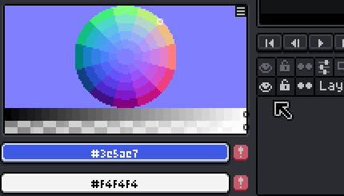

Normal maps can work well for both HD games and pixel-art, adding interesting effects.

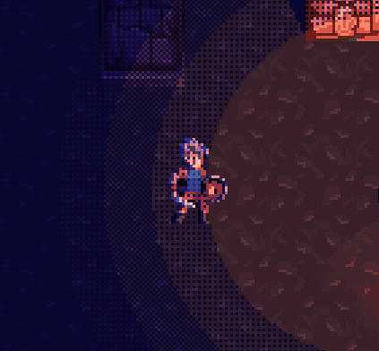

### Metallic, Roughness and Ambient Occlusion

The Metallic, Roughness and Ambient Occlusion sprites are simply grayscale, which is the information that Crystal needs to simulate the surface information.

To create Metallic and Roughness sprites, see this reference image to understand how it works. This basically works like in other software that supports PBR.

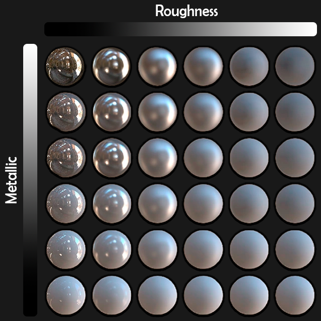

Note that the reflections are more visible as the metallic increases.  
Roughness defines the blur on the surface (see documentation for more info).

Default values:  

**Metallic: 0**  
**Roughness: 0**  
**Ambient Occlusion: 1**  

The sprite pixels can vary, such as being completely solid colors or not.

Using a completely white sprite (and with alpha - if applied), means that, for example, if it is used in metallic, that metallic will be 100%, that is, 100% reflective.

Ambient occlusion is simply multiplied by the world color, so black colors will be shadows, and white colors will do nothing.
