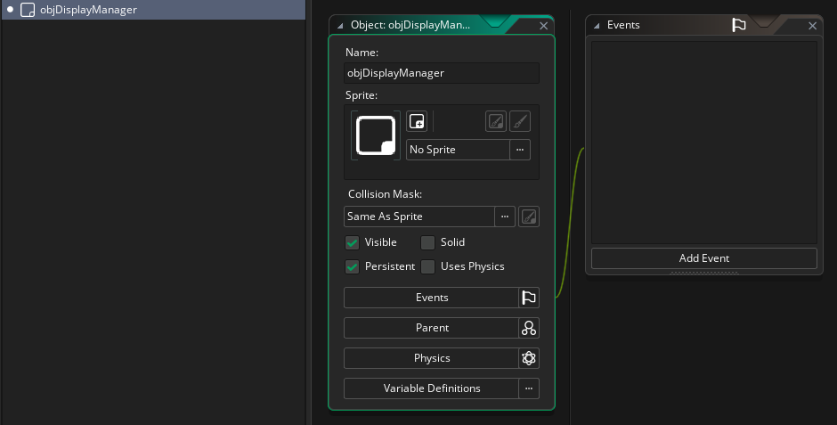
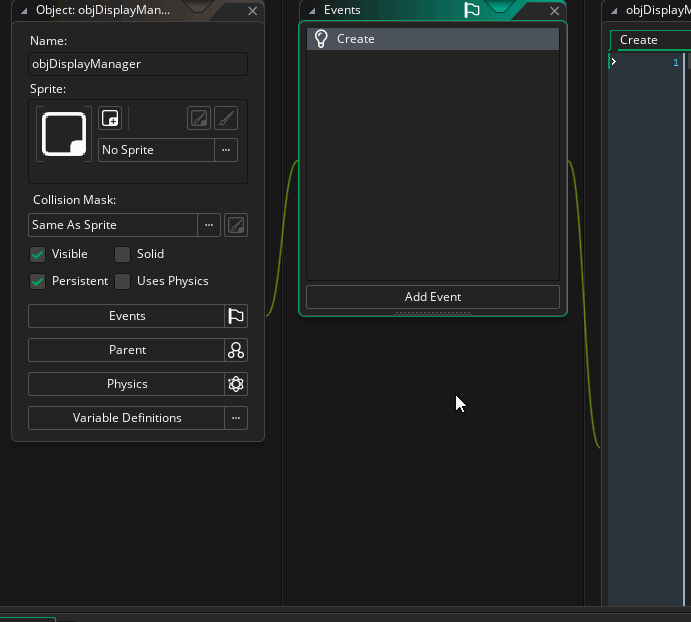
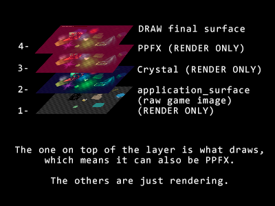

## Introduction <!-- {docsify-ignore} -->

This tutorial covers, in general terms, how to use Crystal with other libraries.  
No knowledge of shaders is required, just basic logic and GML (GameMaker Language).


### Terms

First of all, you need to understand the terms:

**Render/Rendering**: Things are being drawn inside the surface, but the surface itself is not being drawn.  

**Draw**: The surface, with its rendered content inside, is drawn on the screen.

</br>


## 1. Create a new manager object <!-- {docsify-ignore} -->

First, let's create a new object. It will be responsible for controlling the final drawing of the game. 

The object must be one of the first to be created in the game and must always exist, so it is **persistent**.

You can either create the object via code (like using `instance_create_layer()`), or drag it into the room with your mouse.




</br>

Now add a **Post Draw** event to our manager object:

This is the event where we will call the `.Draw()/.DrawInFullscreen()` functions later.

This event, [according to the GameMaker manual](https://manual.gamemaker.io/lts/en/The_Asset_Editors/Object_Properties/Draw_Events.htm), is called after Draw End and before Draw GUI, that is, the ideal place to do what we want.




### Rendering/Drawing Order

There is a specific order for everything to work correctly. This works like layers.  

The basic principle is: The one that will have the **drawing enabled** is the **LAST one to be drawn**.  



Note that this approach is NOT rendering the entire game 4 times, just processing the previous final surface/image with the already rendered pixels.

If, for example, you are using my [KAM (Camera and Resolution Manager)](https://foxyofjungle.itch.io/kam) library, it deals with the final drawing of the game surface, so the drawing function should be called last.

This is the best CALL order:

1 - `application_surface` (game raw surface image)  
2 - Crystal (input surface: `application_surface`)  
3 - Post-Processing (input surface: Crystal)  
4 - Camera Drawing (KAM,Stanncam,PictureFrame) (input surface: PPFX)  

You can run the drawing function depending on whether each component exists.  

</br>


## 2. Move the drawing code to objDisplayManager <!-- {docsify-ignore} -->

Currently, if you _only_ have Crystal _or_ PPFX (for example) in your game, you generally use a single `.Draw()/.DrawInFullscreen()` function to draw the game image with the effects applied, right? right.

Everything works fine... *However*, if you call the draw functions in the same way, it won't work properly, because each function will draw on top of the other using the original game image (application_surface) each time...

**This is wrong:**

```gml
crystalRenderer.DrawInFullscreen(application_surface);
ppfxRenderer.DrawInFullscreen(application_surface);
```

This doesn't work well because both use application_surface. The idea is that, *in order, the next renderer (Crystal, PPFX, etc) you draw uses the image of the previous renderer's surface*.  

**This is how we do it:**

You will move the drawing functions from the `objPostProcessing` and `objLightingManager` objects to our new object (`objDisplayManager`)

Example:  
In `objDisplayManager`'s **Post-Draw** event:

```gml
// Use application_surface as input, originally
var _inputSurf = application_surface; // or view_get_surface(0);

// If there is a lighting system, use it as input for the next one
if (instance_exists(objLightingManager)) {
	_inputSurf = objLightingManager.renderer.GetRenderSurface();
}

// If there is a post-processing, use it as input for the next one
if (instance_exists(objPostProcessing)) {
	objPostProcessing.renderer.DrawInFullscreen(_inputSurf);
	_inputSurf = objPostProcessing.renderer.GetRenderSurface();
}

// ONLY DO THIS IF USING USING KAM
// If using KAM, use it for drawing the final game image:
kamManager.DrawInFullscreen(_inputSurf);

// ONLY DO THIS BELOW IF NOT USING KAM
// By default, ensure that the game will draw if it is the same surface still.
// If not, the above code will draw the game image instead.
application_surface_draw_enable(_inputSurf == application_surface);
```
The only one that draws the surface is the last one. The others are just **rendering**. 

That said, if you need to disable automatic drawing of some libraries:  

(You can do this in the Create Event!)

**Crystal Lighting Engine:**
```gml
// v2
renderer.SetDrawEnable(false); // This will make Crystal only RENDER and not DRAW.
// v1.3.1
// Don't call .Draw(); Only .Render() in the appropriated event.
```

**Post-Processing FX v5:**
```gml
renderer.SetDrawEnable(false); // This will make PPFX only RENDER and not DRAW.
// Only do this if using KAM... because if not, it's the PPFX that will draw your game.
```


</br>

## Alternative <!-- {docsify-ignore} -->

Alternatively, you can use this open source project (made by me too) that handles this in a better way (allows you to change the order in real time and others):

https://github.com/FoxyOfJungle/RenderStack

**WARNING:** This will only be compatible with PPFX v5.0 (final) and Crystal v2.0.


</br>

### Conclusion

That said, you don't need to worry about other things, draw your things inside the `application_surface` normally (in the Draw event) - like water surfaces etc.

All of these things are applied/drawn on top of your game, as if they were "filters".  
