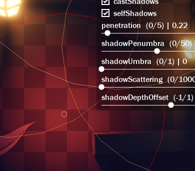

## Crystal Tricks & Tips <!-- {docsify-ignore} -->

Here are some cool tips when using Crystal! :D

## Tips

1. Avoid decimal rotations when using vertex shadows, so you don't see pixels appearing slightly on the edges. Especially if your game uses HD art.

 

2. You can reorder the depth of the shadows to be below the player, in case you want the shadows to follow the outline of the sprite. *Avoid using equal depth*, as there is no guarantee of order. If you want the shadows depth below the player, use +1.

 

3. Emissive particles suddenly increase in intensity when overlapping.

If the particles have "additive" blendmode, this will always happen, as the intensity of the pixels is added together. The solution is to disable this blendmode of the particles and adjust the emission as desired.

 

4. The `shadowDepthOffset` variable of lights is very useful if you are not using `selfShadows`:

This allows you to offset the light shadows depth so that they are drawn **below** the solid, preventing the penumbra from being exposed.

Note that if you want `selfShadows` back and light`penetration` on walls, you need to keep `shadowDepthOffset` at 0, as the shadows need to be drawn **above** the solid so you can see them.

  

## Performance Tips

Overall, don't panic because of these performance tips, only if you are experiencing visible performance issues!
Crystal was developed to be efficient enough, but a few tips never hurt.

1. Enable culling to have Crystal render only what the camera sees. This applies to lights, materials, and shadows (both dynamic and static). So don't worry about the size of the room. It is possible to have infinitely sized rooms. You can enable culling to make this possible by using `.SetCullingEnable()`. You can set distance and others with `.SetCullingSettings()`.
Note that even though Crystal disables rendering of these things, you can still manually disable them using the `enabled` variable.

2. The size of the application_surface (a.k.a. the rendering input surface) directly affects GPU usage.
	- You can use `.SetRenderResolution()` to change the render size of the lighting system (affects all passes). or `.SetPassResolution()` for a single pass.  
	- However, note that this will naturally cause the depth buffer to NOT work properly! This is NOT a bug, it's just how OpenGL works, the depth buffer must be the same size. It is NOT recommended to use this function if you are using the depth buffer. Use `surface_resize` with `application_surface` instead.

3. Avoid checking the "Separate Texture Page" option for sprites in general, this will avoid Texture Swaps, improving performance. Affects CPU usage.
	- Crystal automatically handles texture coordinates used by the lighting system.

4. The most obvious of all is that the fewer lights, the more overall performance. Affect CPU and GPU usage.
	- All lights are drawn on a single surface, so VRAM usage will always be the same, regardless of the amount of lights.

5. "Basic Lights" are ultra efficient. If you want to have lots of lights rendering at the same time (like 10.000), use the parent "__cle_objBasicLight", which is a sprite light.
	- This type of light does not support shadows though. If you want it, use a "Sprite Light" instead. This is because fewer calculations are made.
	- This type of light allows you to draw whatever you want in the Draw Event, so it's a reward for not having shadows.
	- This type of light also does not cause Texture Swaps or Batch Breaks (if using draw_self(), for example), which is good for performance.

6. Each light allows individual optimization by changing the shader used by them. If you only need lights with essential calculations, change `shaderType` to the "Basic" type;  
	A) `LIGHT_SHADER_BASIC` (with essential parameters);  
	B) `LIGHT_SHADER_PHONG` (essential parameters + normal map);  
	C) `LIGHT_SHADER_BRDF` (essential parameters + realistic PBR rendering);  
	- Light cookie is only available in the BRDF shader - for performance reasons.

7. Lights that cast shadows are more heavy, this is expected because each light is essentially drawing the entire shadowmap. This will especially affect GPU usage and a bit of CPU.
	- 3D games usually use 1 to 8 lights with real-time shadows, so you should think about whether it's worth having so many lights that cast shadows.

8. Dynamic shadows are heavy. Try not to overuse them. Affects CPU usage.
	- You can change the type of transformation used on it to the "basic" type, if the object does not rotate and just moves.

9. Static shadows are faster, but they are recreated whenever you delete one, so avoid touching static shadows all the time. Use dynamic ones if you want this. Affects CPU usage.

10. The more detailed the vertex shadow mesh is, the more GPU usage it will have, especially if there are multiple lights casting shadows. Affects GPU usage.

11. Change the shadow caster transformation type.
	- When creating a Crystal_Shadow(), you can set the transformation mode;
	- This will improve performance CPU-side, especially for dynamic shadows!

12. The more materials you render, the more CPU and GPU usage you will have.
	- All materials (Metallic, Roughness and Ambient occlusion) are drawn on a single surface, so VRAM usage will always be the same, regardless of the amount of materials.
	- If you need to render a lot of materials at the same time, it's worth using `Crystal_MaterialLayer()`, which allows you to render everything on a single surface.

13. The `Crystal_Renderer()` does not create any surfaces until a material is created. This is true for: Materials, Normal Maps, Emissive and Reflections.
Furthermore, as soon as there are no materials of each type, the surfaces are automatically destroyed from VRAM.
	- The deferred (combine) surface will always exist as long as render is enabled. (Disable with .SetRenderEnable()).
	- Which means that overall, you will have only 2 surfaces: Lights and Combine (deferred).

14. If you don't need or want to use materials, and only need lights and shadows, disable it with `.SetMaterialsEnable(false)`. This is just a small optimization, because Crystal is smart enough to detect when it needs to use more resources. Affects CPU usage. May affect VRAM usage if you have at least 1 material rendering.
	- This will cause the following materials to not render: Normal Map, Emissive, Reflections and PBR (Metallic, Roughness and Ambient Occlusion)

15. If you are using split-screen view ports, you'll have to draw the entire lighting system twice, one `Crystal_Renderer()` for each view port. So games with a single viewport will always be more efficient overall.

16. HDR will naturally use more VRAM, if you want to optimize this you can disable it. But this will cause post-processing effects like Bloom to not look good or work correctly, especially for emissive materials.
	- Emissive materials will still work, but only within the range 0 - 1 (Low Dynamic Range).

17. If you don't need lights and shadows with depth, disable the Depth Buffer.
	- Do this with `surface_depth_disable(true)`, `gpu_set_zwriteenable(false)` and `gpu_set_ztestenable(false)`. It affects VRAM and GPU usage.
	- It means that alpha testing will not be useful, so disabling it too (with `gpu_set_alphatestenable(false))` will be a considerable performance gain on the GPU side.

18. Lights with shadows cause more batch breaks.

19. If you don't need the following features of the final pass: Dithering, LUT, Materials, you can disable it at compile time.
	- Press CTRL + T
	- Search for `__cle_shDeferredRender`, open the fragment shader and comment out the definitions: `#define ENABLE_*`
	This will be an additional GPU performance gain at compile time.

20. Always compile the project in YYC on the final release, this will always be an additional performance gain for Crystal, including your game in general.

21. Avoid memory leaks, destroy everything you create with `.Destroy()`, on the "Clean Up" event, when are no longer using it. Affects RAM, VRAM, GPU and CPU.
	- Including, but not limited: Materials/Layer Materials, Shadows, Renderers, etc
    - Since lights are objects/instances, they are automatically destroyed from memory when you leave the room (unless they are persistent).

