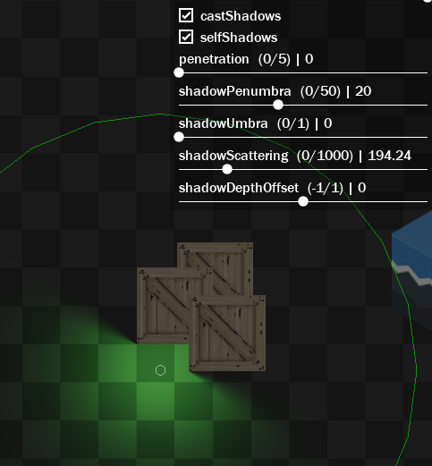

## Solving common issues <!-- {docsify-ignore} -->

Here are listed common issues (not bugs) that you may experience while dealing with the lighting system.

</br>

<div id="custom-lists-page">

## 1. Lights, Shadows and Materials have no depth and I can't control the depth of them

> Dealing with depth may seem like a BUG at first, but reading the explanations calmly will make you understand that everything works correctly.

GameMaker has the [depth buffer](https://manual.gamemaker.io/beta/en/GameMaker_Language/GML_Reference/Drawing/Depth_And_Stencil_Buffer/The_Depth_And_Stencil_Buffer.htm) disabled by default. That said, the order in which graphics in GameMaker are drawn is determined by the order in which the drawing functions are called, and this naturally allows meshes/sprites to be on top of each other. Since Crystal draws lights separately, there is no way to get this depth information without having the depth buffer enabled. The depth buffer is efficient and allows you to sort things using the `depth` variable.

If you want lights, shadows and materials to have depth (ordered in layers or using `depth` variable, for example), you need to enable the depth buffer. **There is no other way**.

This can be done using the following functions:
```gml
gpu_set_zwriteenable(true);
gpu_set_ztestenable(true);
```

> WARNING: Depth buffer may not work if you use the surface_depth_disable() function. Do not use this function if you want depth buffering.

Just call them once, in the Room Start or Create Event of the lighting manager object, for example. Do this when using the lighting system in any room.

> You can enable this only in certain places too, but we recommend keeping it enabled at all times to avoid depth issues.

</br>


## 2. When a transparent object passes over another, it occludes.

You need to enable alpha testing.


You can do this with:
```gml
gpu_set_alphatestenable(true);
```
You can enable this only in certain places too - which is recommended, as this functionality can be a bit heavy on mobile.

It is possible to control the pixel discard threshold using: 
```gml
gpu_set_alphatestref(0 to 255);
```
This will cause GameMaker to discard pixels with alpha below the threshold (like 10 - you choose).

> This kind of alpha issue should not be a problem for UI/GUI event, since GUI event does not have depth buffer and alpha testing is not necessary!


**IMPORTANT:**

If you are using `shader_set()` on something, you may have to do the alpha test manually within the fragment shader.
This is because GameMaker does not add the `DoAlphaTest()` function to the shader internally. This function uses GameMaker parameters.

To fix this, just add it:
Example:
```gml
vec4 mainTex = texture2D(gm_BaseTexture, v_vTexcoord) * v_vColour;
DoAlphaTest(mainTex);
gl_FragColor = mainTex;
```
This may also be useful if you are using custom emissive and normal map shaders.  

If you don't do this, the depth buffer won't clip transparent pixels, and they'll look like shadows when they're not.


### Smooth edges

Since the depth buffer does boolean hardware operations (clipped or unclipped), and we are using [Deferred Rendering](https://en.wikipedia.org/wiki/Deferred_shading) for the best performance, using the depth buffer will automatically cause you to have problems with transparent sprites/graphics. This is a [common, expected and historical issue](https://www.reddit.com/r/GraphicsProgramming/comments/18gp42q/alphadepth_buffer_for_sprites/). No matter how hard you try, no blendmode will fix this problem. The only viable solution would be to draw transparent objects after the opaque ones - but this is not possible in all cases. **This is usually only a problem if you are placing: lights, materials or shadows BELOW other transparent sprites in your game. If they are above them, the problem does not occur.**

If your game is pixel-art, you will have less issues, since there are no edges with opacity, *but still*, **if there is opacity**, you need to do [alpha testing](https://manual.gamemaker.io/beta/en/GameMaker_Language/GML_Reference/Drawing/GPU_Control/gpu_set_alphatestenable.htm).

This is true for HD arts as well.

And now you're wondering, "okay, alpha testing clipped the opacity of some pixels and it's working, but now I have hard edges! what should I do?" You need to use **anti-aliasing** methods, like **FXAA**. [Post-Processing FX](https://kazangames.com/assets/ppfx/) has one built-in if desired.

With FXAA, you can get those smooth edges back, in HD graphics:


### Dithering alpha testing

Alpha testing may not be perfect in situations where you want gradient opacity. That's why Crystal offers a dithering option, so you can work around this. Pixels are discarded using a shader, in the same way as alpha testing, but this time using dithering so that the discarding is not abrupt. This method is used in many games that use Deferred Rendering, such as Sea of ​​Thieves, for example.

Original sprite:


In-game, with dithering alpha test:


To do this, simply use the functions below:

```gml
deferred_alpha_begin(threshold, ...);
draw_sprite(...);
deferred_alpha_end();
```
It is possible to use different bayer textures (Crystal comes with some).

> Since we are using a shader with shader_set(), this overrides the current shader. Alternatively, you can duplicate the effect code in your own shader.

### Alternatives to dithering:

Other alternatives are:
- Disable zwrite (`gpu_set_zwriteenable(false)`) before drawing graphics (This may not work well in all cases).

- Before drawing, disable alpha blending with `gpu_set_blendenable(false);` - This will cause transparency information to be lost (full opaque now);

Note that *this is not ideal*, because if you have **Emissive materials** or **shadows**, for example, they will not be able to get underneath things.


NOTE: remember to enable it later! Example:

```gml
gpu_push_state();
gpu_set_zwriteenable(false);
draw_sprite(...);
gpu_pop_state(); // this will restore the old GPU state
```

> You may be thinking: so whenever I have transparent sprites I will have to ALWAYS do this? Not exactly. Generally if you are using graphics from Crystal: lights, shadows and materials (including emissive) and you want to avoid problems with opacity and depth with them. Taking into account that GameMaker draws things on top of each other using layers (without the need of a depth buffer).

> It's important to make clear that this is not something specific to Crystal, but just how graphics work in general. Depth buffer is hard to deal with, I'm sorry, I don't like it either. Unfortunately it's the only way currently to do depth sorting efficiently.

</br>


## 3. The object/sprite is transparent and/or sprite that was previously visible, became invisible after enabling depth buffer and alpha testing:

- See previous items.

- When drawing a sprite, for example, it could be that the depth at which it is drawing has been changed by something else in your own code.
Check that there is no other code setting the drawing depth with `gpu_set_depth()`. You can quickly fix by writing `gpu_set_depth(depth)` before drawing something, for example.

It is good practice to always return to the previous depth!
```gml
var _oldDepth = gpu_get_depth();
gpu_set_depth(depth);
// < draw stuff >
gpu_set_depth(_oldDepth);
```
> WARNING: `depth` is not saved with `gpu_push_state()`!!!

</br>


## 4. All I see is a black screen!

There are several reasons why this might happen.

- Please follow the **Quick Start (Getting Started) guide** carefully. If you followed it correctly, it will work.
- Make sure you have added the object where you are creating the Crystal renderer to the room.
- You need to have a camera and view active for Crystal to render using the camera.

> Try to avoid the room's built-in camera if possible (I don't trust it - caused problems in the past). Create a camera via code instead.

- Check the console log for errors.

</br>


## 5. I don't see any shadows!

There are several reasons why shadows don't work, such as:

- Check if you are calling `.Apply()` on the shadows, so that they are created;
- Check if shadows are being created **after** the `Crystal_Renderer` exists;
- Check if there are no errors in the console log;
- You need to enable the `castShadows` variable/option on the light you want to cast shadows;
- The lights need to be `enabled` and visible on the camera view to see shadows;
- Check the light `intensity`: Shadows only appear when the light is bright enough to see (greater than `0`); In the real world, you only see shadows because there is light;
- Check the shadow `depth` and `shadowDepthOffset` on the lights;
- Check the `shadowLength` in the shadow caster, it should be larger than `0`, sou you can see the shadow;
- If the light is of the "Basic Light" type, it does not support shadows, all others do;
- For top down RPG games, `depth = -y` is the way to go. For platformer games, layers should work normally too. You can use `layer_get_depth()` to get the depth of a layer;
- If you have Culling enabled, make sure it is configured correctly (see documentation);
- You can debug with `crystal_debug_show()` - see "Debugging" tutorial;

</br>


## 6. I don't see the material!

There are several reasons why material don't work, such as:  

- You need to activate the materials feature in the renderer (they are disabled by default - since not everyone needs materials):
```gml
renderer.SetMaterialsEnable(true);
```  
- Check if you are calling `.Apply()` on the material, so that they are created;
- Check if the material is being created **after** the `Crystal_Renderer` exists;
- Check if there are no errors in the console log;
- Check the material `depth`, if the material is not being drawn below something;
- If the instance moves, you need to update the position, angle and scale manually, or use ".Sync*" functions in the Step Event;
```gml
material.x = x;
material.y = y;
material.angle = image_angle;
material.xScale = image_xscale;
material.yScale = image_yscale;
// etc. Remembering that the material is just a sprite! (or surface, if it's a layer)
```
- For normal maps etc, the light shader must be `LIGHT_SHADER_PHONG` or `LIGHT_SHADER_BRDF`. The basic shader does not receive the materials in the shader, so you will not see the materials even though they are there.;
- For top down RPG games, `depth = -y` is the way to go. For platformer games, layers should work normally too. You can use `layer_get_depth()` to get the depth of a layer;
- If you have Culling enabled, make sure it is configured correctly (see documentation);
- You can debug with `crystal_debug_show()` - see "Debugging" tutorial.

</br>


## 7. My UI disappeared! (Or it has weird opacity artifacts)

The UI does not need depth buffer (ztest, zwrite), culling and alpha testing. So make sure to **RESET GPU states BEFORE drawing the UI** in Draw GUI or something else (Draw End).

Also make sure to enable alpha *blending* again with `gpu_set_blendenable(true)`.

Crystal does not automatically restore what YOU set.

</br>


## 8. How to have any layer or graphic unlit (without being affected by lights)

If you want something to not be affected by lighting (including ambient light), shadows, there are a few ways around this:

- **Add an emissive material**.  
**A)** This is most useful for effects like street lights, fire, and the like. Not useful for dust/smoke particles.  
The emissive material is not affected by the ambient light or other lights (only if it is additive - configured in the fragment shader of the combine pass - not recommended to change).  
**B)** This can be done using `Crystal_Material()` - see manual for more info. Just set the `emissiveSprite` and use `.Apply()`. Set the emission with emission.  
```gml
material = new Crystal_Material(id);
material.emissiveSprite = sprFire;
material.emission = 1;
material.Apply();
```
Then you can use (optionally) Bloom effects (not included, but you can use [Post-Processing FX](https://foxyofjungle.itch.io/post-processing-fx)) to make whatever is emissive glow based on the emission.  

> You can also do the same with layers, using Crystal_MaterialLayer (see documentation).

> You can also draw on the emissive pass using `crystal_pass_submit` and use any code (see documentation for more details).

- **Add a Direct light**.  
**A)** This works well for everything: Layers, individual instances, texts in the room, particles, etc. *NOT RECOMMENDED FOR UI*.  
**B)** These are extremely light lights (the lightest of the Crystal), so you can add multiple lights without worrying too much with performance.  
**C)** Use the `LIGHT_SHADER_BASIC` shader.  
**D)** The depth of this light MUST be *exactly the same* as the depth of the thing (instance or graphic, when using `gpu_set_depth()` - and with depth buffer enabled) you want to illuminate.  
**E)** Setting `litType = LIT_EQUAL` causes the light to illuminate only the specified depth.  
```gml
light = instance_create_layer(... objDirectLight); //  Create a direct light
light.shaderType = LIGHT_SHADER_BASIC;
light.litType = LIT_EQUAL; // Make sure it will illuminate only the specifica depth
light.depth = depth; // define the light's depth
```
**F)** If the instance changes depth, you need to update the light's depth as well, otherwise the light will no longer illuminate the object. If you don't do this, the light will stop illuminating the depth of the graphic/object in question.   
```gml
light.depth = depth;
```
**G)** To avoid altering the brightness of the pixels, the `intensity` of the Direct light must be `1` (default), and the renderer's `.SetLightsIntensity()` and `.SetLightsCompensation()` must also be `1`.

- **Draw it in the Combine pass**.  
**A)** Useful for UI, specifically.  
Just like if you used the *Draw End* event. Except that it is still executed inside the final Crystal surface, which means that if you use post-processing, the output will include what you drew in this pass.  
**B)** This pass is executed after the lights, shadows, materials etc are drawn, and is in world-space (camera-space), i.e. it follows the room coordinates.  
To draw on this pass, use like this:
crystal_pass_submit(CRYSTAL_PASS.COMBINE, function() {
    // < draw anything drawable from GameMaker here >
    // Note: Since there is currently no support for closures in GameMaker (access local variables outside of this function), you may need to use instance variables to avoid losing access.
});
**C)** Depth buffer for sorting is not supported here (In fact, it's disabled *automatically* - What determines the depth is the order in which the drawing functions are called - like other things).

</br>


## 9. Emissive Sprites and HDR

Emissive materials are nothing more than sprites or surfaces (for Layers) drawn outside the ambient light and with an emission shader applied. The emission shader only increases the exposure of the pixels. `emission` above the Bloom threshold makes the emissive sprite glow.

`emission` can range from 0 to infinity, but generally you don't want it to go above 6 or so. If you use 0, the sprite will be black. 1 means no emission (normal state). The emission os basically `RGB * emission`.

For emissive sprites to glow, Crystal needs to have HDR enabled. Use `renderer.SetHDREnable(true)`.

If lightmap HDR is also enabled (with `.SetLightsHDREnable(true)`), overlapping lights will also glow with Bloom. If you don't want this, you can leave it disabled.

Note that to get the Bloom effect, you need [Post-Processing FX](https://foxyofjungle.itch.io/post-processing-fx) or any other generic bloom shader.

</br>


## 10. Lights stopped working when updating the library

Check that the children of the lights are still with the parents included in the library, in the "Assets" folder inside Crystal's folder.

</br>


## 11. Materials on the same layer (depth) and wrong draw depth

If a `Crystal_Material` is on the SAME depth as another material, the drawing order is NOT guaranteed. It's just that the system has *no way* of knowing which one is drawn first in this way.

This is not a serious issue IF the materials do NOT overlap.

To ensure the drawing order, the depth of the materials NEEDS to be different.
Don't be afraid to create more layers if necessary, the layers only indicate the draw depth/order (GM layers are not surfaces). You may use folders for organization. Naturally enemies should be on a different layer than the player anyway.
Note: the depth of the material does not necessarily need to be equal to the depth of your instance/object. The "depth" variable defines the drawing order of the material.

This isn't always a problem if you're spawning objects, since Crystal adds materials to the system in reverse order.

A single `Crystal_Material()` contains sprites of: emissive, normal, metallic, roughness, ao, reflections, etc. All of these obey the same material `depth` variable.

</br>


## 12. Shadows on the same layer (a.k.a same depth) look weird

As with materials and other things, the depth of shadows is **not guaranteed** to be the same as other shadows. You must **explicitly define the depth** at which they are drawn, either by creating new layers, or by using the `depth` variable.

If light's `selfShadows` is `false`, Crystal_Shadow's `shadowLength` is small and the shadow is at the same depth as another, this is not noticeable if `shadowDepthOffset` is greater than 0:


If the `shadowLength` of the shadow (or light's `shadowScattering`) is large, and light's `selfShadows` is `true`, the `Crystal_Shadow` can be at the same depth without any problems.



</br>


## 13. Shadows make some lights disappear sometimes

*This can happen in some cases, such as enabling shadows from direct lights, for example.*

This is more likely to happen if the light has castShadows enabled.  

This is not a bug. This can be fixed by changing the `depth` of `Crystal_Shadow()` to some lower value. Or by changing the `shadowDepthOffset` variable of the light (like leaving it at `1`, so that the shadows are drawn below).

> My advice is to try to keep the shadows below the lights, and if possible in close layers. Example: a layer/depth just for shadows, and then the lights above (in many layers/depths you want).

</br>


## 14. Light with shadows when entering a wall, does not illuminate outside the shadow caster mesh

This is expected, if you have set the shadow's `shadowLength` to some high value, or if the light's `shadowScattering` is also high.  

Even though the light, **with shadows turned on**, is at the depth below, the shadow depth is still at the depth of the `Crystal_Shadow`. When light enters the block, shadows are cast outward, which is expected.

</br>


## 15. Using Crystal with Spine.

When using Crystal, if you just want lights, without materials (normal map, emissive, PBR), you can use Spine sprites normally without any problems. And there is support for animation mixing and everything.

Though, is using Materials, although Spine sprites work, the animation mix is ​​not well supported by Materials. Unfortunately, GameMaker speeds up the skeleton timeline whenever I try to manually draw it more than once in each instance. So a possible solution is to use ghost instances, which follow the player position, rotation, scaling and animation. Each ghost instance would have a material applied. You can try using `crystal_pass_submit()` to manually draw the Spine sprite in the appropriate pass, if you need.  

If using Materials, you should duplicate the Spine sprite for each type: Normal Maps, Emissive, etc (it works the same as bitmap sprites). This means duplicating the physical json sprite and replacing the PNG atlas with the normal map one, for example.  


I understand that it is not the best thing, but it was the best I could do, due to GameMaker's Spine support limitations.

Note that if the bone rotates 360 degrees, the normal map may also rotate, and this may cause the lights to be interpreted differently (erroneously). Crystal only resolves the rotation issue for the FULL rotation of the sprite/material. I'm not sure exactly what the solution is for this, but can you try flipping the bone's normal map sprite bitmap during rotation?

Shadows for Spine sprites can be problematic, as it is a dynamic Skeleton, vertex shadows are not recommended, unless you create generic shapes. Because you would have to create an animation for every frame, which will be super laborious and not worth it. Sprite shadows are a bit problematic too, unless you draw your yown shadows somehow.

</br>


## 16. Light leaks through the wall (even with shadows)

Everything **below the Crystal_Shadow()'s depth will be occluded by light's shadow**. This means that if you, for example, have two layers in a room: "Walls" and "Enemies", if you place "Walls" ⬇️ *below* ⬇️ "Enemies", the shadows from the light will not block that enemy.

My recommendation is to always keep the depth of the lights _above_ ⬆️ the depth of the shadows (it's not a rule, but it avoids confusion).

> Important note: The shadows vertex buffer is drawn for **each** light with shadows. But they STILL obey their depth. Each light which support shadows has the ability to add an offset to the depth of shadows as well, offering better control of the situation. Shadows outside the camera view do not generate vertices (if Culling is enabled). This is valid for dynamic and static shadows, depending on the Culling configuration set.

Order (❌Light leaks through the wall):
- Enemies
- Walls


Order (✔️Correct):
- Walls
- Enemies


> REMEMBER: This is just an EXAMPLE. Your layers and objects DO NOT NECESSARILY NEED to be below or above. This is defined by the `depth` of the `Crystal_Shadow()`, and not necessarily the depth of the object/instance itself.

> There are no bugs in how it currently works, you just need to experiment it to understand how it works.


</div>
